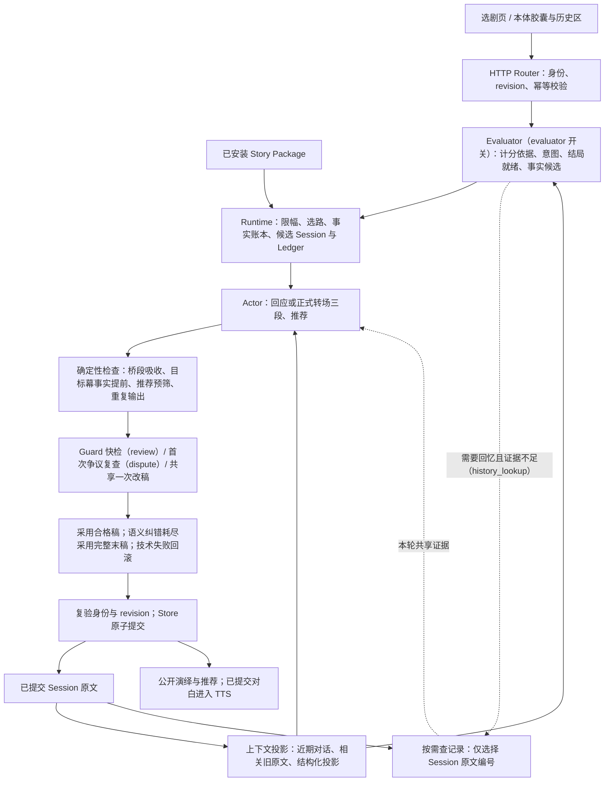
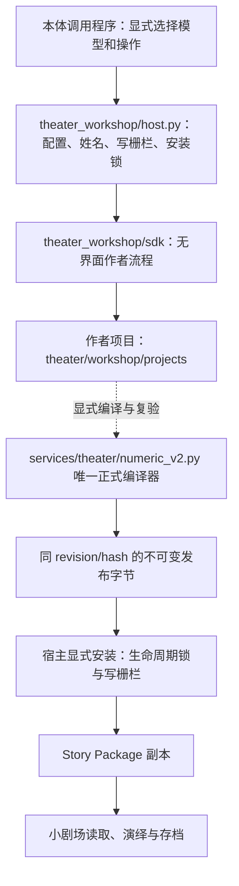
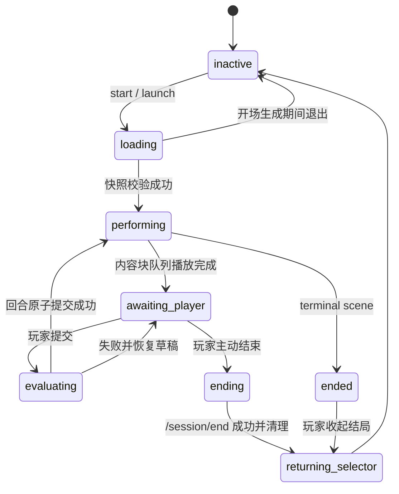

# N.E.K.O 小剧场架构

状态：Numeric v2.2。本文只描述当前实现合同：模块与权限、数据合同、回合流水线、复核与确定性检查、生命周期与事务、前端胶囊展示合同和可选模块开关。代码与测试高于本文；实现与本文不一致时，先修正其中之一，不在文档里并列新旧两套方案。

| 需要了解 | 入口 |
| --- | --- |
| 当前运行、数据、前端合同 | 本文 |
| 为什么这样设计、否决过什么、仍未验证什么 | [小剧场设计决策记录](./neko-theater-decisions.md) |
| 剧本工坊 SDK 的调用、宿主与发布合同 | 仓库 `theater_workshop/README.md` |
| 各阶段 Token 上限的汇总 | [LLM Prompt 预算](./llm-prompt-budget.md) |

实现存在不等于体验已验收；未覆盖的范围集中列在决策记录的“已知风险与未验证范围”。

## 架构总览

### 小剧场回合



默认只开启 `evaluator`；`review` 等模型复核默认关闭，此时 Guard 不被调用，但确定性检查、原子提交和身份复验照常执行（第 5.1 节）。

### 剧本工坊



工坊只产出作者项目和 Story Package，不读取玩家 Session，也不参与运行时选路；调用合同见 `theater_workshop/README.md`。

## 1. 产品边界

小剧场只有 Numeric v2 剧本模式。`/theater` 是唯一页面入口，负责选剧、查看前情与角色身份、开始或继续 Session、导入删除剧本和记忆档案；正式演绎在 N.E.K.O 本体胶囊与历史区中进行。自由模式、`/theater-home`、`/theater-numeric` 和 `/api/theater` 已退役，不提供重定向。

小剧场与普通聊天只共享当前猫娘配置、聊天宿主和底层 TTS，不共享输入状态、草稿、历史、恢复指针或正式事实。剧场控制器只在 Session 激活且等待玩家输入时接管胶囊输入框；未激活时完全退出普通聊天链路。

产品定位：

- 作者控制背景、双角色身份、主线、支线、结局、隐藏数值规则、路线条件、过渡合同和可核验的完成事实；
- 玩家用自然语言决定当下行动；推荐输入只是可选的自然语言快捷输入，不存在正式 Choice；
- 前置 Evaluator 判断隐藏数值变化、自然收束信号、转场态度、候选结局就绪与事实候选；
- Actor 在同一次调用中生成旁白、猫娘动作与对白以及推荐输入；
- Runtime 确定性处理数值限幅、选路、结局、邀请锁存、事实账本、Ledger、Session 和原子提交；
- 隐藏数值、阈值、路线条件和内部判定依据不对玩家公开。

## 2. 模块与权限

下表以当前生产导入关系为准。“读取”指只读投影；剧情状态只能经 Runtime 和 Store 的原子提交写入。

### 2.1 运行端（`services/theater/`）

| 模块 | 职责与边界 |
| --- | --- |
| `numeric_v2.py` | 唯一正式 Story Package 编译器：校验 v2.2 合同、事实与完成合同、转场合同、规范化字节、静态图和可达性；不生成演绎、不持有 Session。 |
| `numeric_v2_registry.py` | 已安装包的导入、列举、读取、版本/hash 校验和删除；跨进程锁内原子发布，不覆盖同 ID。 |
| `numeric_v2_identity.py` | 读取当前猫娘角色卡与不可变 `character_id`，建立 Session 的角色绑定；提供工坊用的窄姓名快照。 |
| `numeric_v2_cast.py`、`name_projection.py` | 把作者稿双主角姓名单次投影为当前玩家昵称、当前猫娘名，或未披露时的“你”；不改作者包。 |
| `llm_context.py` | 人格读取、玩家称呼读取和 Prompt 文本截断辅助。 |
| `numeric_v2_evaluator.py` | 前置判定（计分依据、意图、结局就绪、事实候选）、Guard 快检/争议复查和作者禁令窄判定；只能选择作者声明的枚举，不选路线、不写 Session。 |
| `numeric_v2_actor.py` | 组装表现上下文与 Prompt，调用 Actor 生成正文、三段转场和推荐；带重复输出来源标签；不提交状态。 |
| `numeric_v2_actor_output.py`、`numeric_v2_json.py` | 解析 Actor JSON（只解包完整单个围栏）、校验正文/推荐/三段、保护玩家行动归属；不调用模型。 |
| `numeric_v2_context.py` | Actor/Evaluator/Guard 共用的历史、场景、作者边界（`project_contract_boundaries`）、实际开场与目标幕事实泄露检查。 |
| `numeric_v2_action_projection.py` | 从玩家原话和已提交结果确定性投影玩家动作结果（离开、签名、交付等）与未来约定；不推断目的地或意图。 |
| `numeric_v2_budget.py` | 固定输入预算；`economy / balanced / quality` 只是同预算别名。 |
| `numeric_v2_history.py` | 证据不足时让模型选择已提交原文编号，再由代码核验还原；不生成摘要事实。 |
| `numeric_v2_fixed_narration.py` | 作者固定旁白的校验、触发候选、依赖顺序、逐字交付、交接方向与离幕前必显。 |
| `numeric_v2_performance.py` | 把演出形状转换为有序内容块（旁白、动作、对白、固定旁白），供历史、恢复与 TTS 坐标使用。 |
| `numeric_v2_runtime.py` | 确定性状态引擎：限幅、选路、结局、邀请、`story_state` 事实账本、完成合同判定、Ledger 事件、时间线与事实证据投影、版本冲突。 |
| `numeric_v2_workflow.py` | 回合编排：Evaluator → Runtime 候选 → Actor → 确定性检查 → 条件复核/改稿 → 身份与 revision 复验 → 原子提交；记录分阶段诊断。 |
| `numeric_v2_store.py` | 原子保存/读取 Session、Ledger、演出历史、恢复槽和索引；拒绝重复回合与 stale revision。 |
| `numeric_v2_storage_transaction.py` | 把最终磁盘变更放进云存档写栅栏；不包住模型等待。 |
| `numeric_v2_archive.py` | 结束回执、公开单集记忆胶囊、公开冷档案、遗忘事务与冷档案隔离区。 |
| `numeric_v2_maintenance.py` | 冷启动存储审计、删除事务恢复、角色清理意图重试、隔离区与可恢复剧本删除。 |
| `numeric_v2_options.py` | 8 个可选模块开关的唯一清单：键、默认值、存储键、关闭代价。 |
| `numeric_v2_structured_output.py` | 按现有 Actor/Guard 输出合同生成严格 JSON Schema，并只对已核实的供应商与模型附加 `response_format`（第 5.5 节）；只约束形状，不替代解析器的语义与引文校验。 |
| `numeric_v2_usage.py` | 请求作用域的模型用量观测；缺失供应商用量保持未知。 |
| `numeric_v2_trace.py` | 由 `NEKO_THEATER_TRACE_DIR` 显式开启的演绎文案 JSONL 诊断。 |
| `paths.py` | 按 `ConfigManager` 当前存储策略解析小剧场根目录。 |
| `tts_bridge.py` | 把已提交对白交给现有 TTS 管线；失败只降级为文字。 |

### 2.2 HTTP、页面与本体表现

| 模块 | 职责与边界 |
| --- | --- |
| `main_routers/numeric_theater_router.py` | `/api/theater-numeric`：剧本列表与导入删除、Session 生命周期、模块开关、内容块朗读、归档与记忆档案；不重新实现 Runtime 规则。 |
| `main_routers/pages_router.py` | 提供 `/theater` 与 `/theater/settings`，登记静态资源。 |
| `templates/theater.html`、`static/js/theater_selector.js`、`static/css/theater_selector.css` | 选剧页：剧本列表与详情、开始/继续交接、导入删除、结束回执与记忆询问、记忆档案管理。 |
| `templates/theater_settings.html`、`static/js/theater_settings.js`、`static/css/theater_settings.css` | 模块开关设置页；只显示后端声明的开关和关闭影响。 |
| `static/js/theater_transport.js` | 选剧页与本体共用的消息 schema、请求 ID、JSON/CSRF 请求和跨窗口交接。 |
| `static/app/app-theater-runtime.js` | 本体剧场控制器：启动与恢复、真实输入框接管、历史投影、内容块播放、TTS、结束与刷新恢复、主动搭话抑制。 |
| `static/app/app-proactive.js` | 主动搭话调度；读取剧场控制器的临时抑制并随 leader 心跳传播（第 8.6 节）。 |
| `frontend/react-neko-chat/src/*` | 胶囊 `theaterPresentation` 投影、独立剧场草稿、历史面板剧场模式、Galgame 推荐槽复用。 |
| `app/memory_server/routes.py`、`memory/recent.py`、`memory/timeindex.py`、`main_routers/memory_router.py` | 接收剧场单集归档、维护有界周目记忆与时间索引，隔离普通 Prompt；记忆浏览器保存时原样保留剧场胶囊。 |
| `utils/llm_client/messages.py` | 消息来源元数据与剧场记忆识别（`is_theater_memory_message`）；发送给供应商前剥离元数据。 |

### 2.3 剧本工坊 SDK（`theater_workshop/`）

| 模块 | 职责与边界 |
| --- | --- |
| `host.py` | 本体宿主适配：模型、姓名、项目根、写栅栏、编译/复验/安装网关；不启动网页、不参与演绎回合。 |
| `release_smoke.py` | 源码环境的固定模型发行冒烟检查；不属于生产演绎链。 |
| `sdk/contracts.py` | 与 HTTP 无关的作者输入 DTO、revision、节点/支线/结局和发布请求合同。 |
| `sdk/model.py` | 注入式同步模型调用、用量捕获和模型错误边界；不带默认模型或密钥。 |
| `sdk/json_response.py` | 保留字符串原文的有限 JSON 语法修复；失败时报告。 |
| `sdk/packages.py` | 编译/发布/安装网关协议和不可变发布候选。 |
| `sdk/workshop.py` | 作者项目业务编排：创建、编辑、生成、评分、修订、编译、复验和发布。 |
| `sdk/numeric_v2.py` | 作者字段投影（含完成事实、出口计划）、metric 预设和正式编译调用。 |
| `sdk/numeric_v2_project_store.py` | 作者项目 revision、检查点、失败候选、报告失效和原子持久化。 |
| `sdk/numeric_v2_analysis.py` | 数值与路线静态分析：可达性、优先级遮蔽、软节奏和 unknown 诊断；不调用模型。 |
| `sdk/numeric_v2_branch.py` | 终点先行的支线合同、候选检查和显式应用。 |
| `sdk/generation/*` | 主线/续写/完善/支线生成，事实检查、证据复核、文学评分、方案复核和限定修订；`runtime_rules.py` 维护共享运行语义。 |

`__init__.py` 只提供包入口与公开导出，不创建宿主、不取得写锁、不调用模型。

### 2.4 压测与固定评测入口

| 脚本 | 用途 |
| --- | --- |
| `scripts/run_numeric_v2_stress.py` | 隔离 Session/报告/日志的真实模型多轮压测；支持推荐/自由/混合输入、指定 revision 分叉、`--trace-dir`；不写正式存档、不调用 TTS。 |
| `scripts/evaluate_numeric_v2_review.py` | 用冻结正反例统计普通复核的误杀、漏放、命中率和耗时。 |
| `scripts/evaluate_numeric_v2_completion_facts.py` | 用冻结正反例统计完成事实“模型提议”与“Runtime 接纳”的差异。 |
| `scripts/validate_numeric_v2_story.py` | 对单个 Story Package 执行 v2.2 编译校验；`--install` 与路由导入共用 8 MiB 上限和云存档写栅栏（维护模式返回可重试的 `CLOUDSAVE_WRITE_FENCE_ACTIVE`）。 |

### 2.5 权限边界

- 运行时没有独立 Planner、Director、自动文学评分或动态剧情规划层；工坊评分/修订只属于作者流程。
- Evaluator 不能选择路线、编写剧情或写 Session；它的事实候选只是提议。
- Actor 与推荐不能直接修改 metric、节点、路线、结局、事实账本或 Ledger；只有提交的可见演绎成为后续历史。
- Runtime 不解释自然语言，只应用已验证 delta、已裁定事实操作，并从作者声明的路线中确定性选路。
- 前端不能提交隐藏 metric、阈值、目标节点或朗读文本。
- Store 只提交完整候选回合（含按规则采用的语义末稿），不保存模型执行中的半状态；提交成功不等于复核通过。
- TTS 失败只降级为文字，不回滚已提交剧情。

### 2.6 公共数据的职责

| 数据 | 所有者与作用 | 不应混入 |
| --- | --- | --- |
| 作者项目 | 工坊 Store：草稿、画布、检查点、支线预览、评分、作者 revision | 玩家 Session、演出进度 |
| Story Package | 唯一正式编译器校验；显式编译、复验后导出或安装 | 编辑器状态、模型设置、评分报告、玩家历史 |
| Session | 当前节点、隐藏数值、邀请状态、事实账本、身份、包 hash 与已提交演绎 | 未采用候选、半状态、作者目标完成回执 |
| Ledger | 与 Session 同次提交的回合事件：输入、revision、计分、事实操作、转场结果 | 可独立修改的第二剧情真源 |
| Performance 与文案日志 | Performance 是可展示/恢复的演出；JSONL 是仓库外可选诊断 | 诊断不能反写历史，“模型返回”不等于“已提交” |

作者项目与正式包通过发布字节和 hash 交接，Session 绑定明确的包版本。

## 3. Story Package 合同

只接受 `neko.story.numeric.v2` 且 `meta.contract_version: "v2.2"`。顶层：`meta`、`intro`、`characters`、`catgirl_binding`、`metric_schema`、`initial_state`、`start_node_id`、`nodes`、`endings`，以及可选 `fact_contract`。Story Package 不含 Session、Ledger、演绎历史或工坊项目元数据。

旧版本或缺少当前必需字段的包返回 `numeric_v2_upgrade_required` 或编译错误，必须由工坊重新导出；Runtime 不做隐式迁移，也不删除磁盘上的旧包。

工坊写稿与获准的单节点修订区分公开文案和创作要求：`opening_scene`、`entry_bridge`、`transition_contract.bridge_scene_narration`、`fallback_offer` 与新生成的 `fixed_narrations.text` 只写玩家可读的叙事或角色发言；承接历史、保持道具状态等要求放在既有状态、禁令与转场保留项中。无法确定的动态细节省略，不写成调度说明或补造结果。既有固定原文仍受原编辑权限保护；此写作合同不等于编译器已能判定所有语义问题，也不自动修订已安装剧本。

### 3.1 角色与身份

- 新工坊在 `intro.player_name`、`intro.catgirl_name` 成对保存完整姓名，身份描述以对应姓名和中文逗号开头；两字段都缺失的旧 v2.2 作者包仍可从身份首段读取姓名，首段须非空、不同且不超过 24 字符。
- 男主由用户扮演：`player_address_known=false` 时 Actor 只看到“你”，直到玩家本轮作出包含完整配置昵称的明确自我介绍或称呼请求，并由成功回合原子确认；仅提及昵称不算披露。已知时使用 `主人.昵称`，缺失回退 `主人.档案名`，最后“你”。
- 女主统一使用当前角色卡猫娘名；候选原名不能出现在 Actor 输出中；玩家与猫娘的行为、经历和台词归属不能交换。
- 角色卡不可变 ID 只用于存储身份，不进入人格正文。
- 名称投影只作用于叙事数据，最长姓名优先、单次替换，保护协议枚举和引用 ID。开演时按当时角色适配；切换角色不转移既有 Session 的角色归属。

### 3.2 隐藏数值

- `metric_schema` 定义数值 ID、范围、bands 和规则；`initial_state.metrics` 必须完整覆盖；`initial_state.player_address_known` 是结构化布尔值。
- 可选 `relationship_effect` 只能是 `positive / negative / none`，由作者显式声明，Runtime 不按 ID 或名称猜测。
- 每个 metric 的 `per_turn_limit.increase/decrease` 为 1—5 的整数；`[-5,+5]` 是单轮硬上限。
- Evaluator 只能选择作者声明的 `criterion_id` 和强度 `weak / normal / strong / decisive`；服务端按对应方向限幅确定性换算：`weak=1`、`normal=ceil(limit/3)`、`strong=ceil(2×limit/3)`、`decisive=limit`。同一已完成行为的重复确认或改述不再计分；新的有意义行为可沿同一依据连续计分。这是模型语义判断，不保证识别所有远期重复。

### 3.3 节点、路线与结局

- 非结局节点的 `min_turns`（1—20）只是作者提示；`recommended_turns`（`min_turns`—40）是软节奏预算，只改变 Actor 看到的 `normal / closure / overdue` 说明，不触发路线、不改变 route gate。
- 普通换幕需要玩家接受当前访问中真实公开的邀请（`accept`），或明确主动要求前往已公开的下一地点/阶段（`initiate`）；询问、考虑、准备不算。拒绝或暂缓过的邀请在本轮明确改主意接受同一步时可直接继续。
- 多条路线同时满足时只选唯一最高 priority；同优先级并列非法。单出口节点允许空条件；多出口时每条都必须有明确数值条件；每个可达非结局节点最终必须能到达 terminal ending。
- 自然结局：当前路线预览含结局上下文、最后互动已完成、无未决选择时，Evaluator 可返回 `natural_ending_ready=true`；Runtime 仅在 `scene_complete=true`、选中 terminal ending、没有拒绝当前提议且结算前后同一路线时自然结束。
- 进入 terminal node 后 Session 标记为 `ended`，前端显示公开结局并关闭输入；结局类型只是作者语义。

`story_beat` 提供创作上下文，不是运行时任务：`opening_scene`（入幕事实与阶段边界）、`relationship_ceiling`（`stranger / guarded / cooperative / trusted / intimate`）、`character_state`、`acting_contract`、`opening_only_boundaries`（最多 4 条，仅开场有效）、`must_not_happen`、`goals`（作者元数据，最多 8 项，Runtime 不消费）。目标、道具和过渡描述只是素材，不构成收幕条件；可核验的离幕条件使用第 3.5 节的完成合同。

路线 `transition_contract` 包括 `must_deliver`（换场必须可见交付的事件或关键道具）、`must_preserve`（换场后不得矛盾的已发生事实，不要求复述）、可选桥段文案，以及第 3.5 节的 `fallback_offer / accept_input`。

工坊主线携带道具与支线出口自动投影到 `must_preserve` 的只有名称和固定用途；道具生命周期中的持有人、位置与操作结果仍留在作者稿，不自动升格为永久事实。作者显式写出的保留项与延续状态继续导出，演绎仍须按真实历史核对；已安装包不自动重写。

### 3.4 作者固定旁白

`story_beat.fixed_narrations` 是可选扩展；每项字段：

| 字段 | 含义 |
| --- | --- |
| `id` | 同幕唯一编号 |
| `text` | 作者原文，内部空白、换行、引号原样保存；不接受空串或首尾空白 |
| `trigger` | `{"type":"entry"}`，或 `{"type":"condition","condition":"明确的可观察完成事件"}`；条件触发可选布尔 `player_handoff_required` |
| `after` | 同幕更早片段编号数组；不允许循环依赖 |
| `required_before_exit` | 是否要求展示后才能离幕或自然结束 |

- 每幕最多 8 项、原文合计最多 2000 tokens，超限报错不截断；结局节点只能用 `entry`；入幕片段不能依赖条件片段。
- 入幕片段由程序在场景说明后、猫娘演出前插入，开场与正式换幕均适用；新建 Session 只接受与当前姓名投影一致的入幕片段。
- 条件片段只在 `review` 开启时判定：Guard 在同一次调用中返回 `fixed_narration_triggers: [{id,evidence}]`，程序校验引文逐字出现在已提交历史、玩家输入或当前正文中，并校验编号、前置片段和未展示状态，再在最终正文后插入。考虑、邀请和推荐不构成已发生动作。
- 交接方向：条件写成猫娘“接过/收到/拿到”一类接收语义时，候选正文里的同一句不能自证触发，必须有玩家本轮递交表达或已提交历史中的交接证据。`player_handoff_required` 显式声明时优先：`true` 要求玩家实际递交；`false` 允许触碰或观察而不改变持有人，但引文实际写成接收动作时仍走上述交接保护；未声明时按条件措辞沿用该保护。`false` 不授权改变持有人或替玩家行动，Actor 与 Guard 都收到对应说明。
- 原文代写：本轮有待触发条件片段时，Guard 同次定位可报 `fixed_narration_content`（只能对应 `author_boundary`），见第 5.2 节；Actor 与 Guard 都看不到未公开原文。
- Actor 看不到未触发原文、片段 ID 或依赖列表；只采用最终稿对应的无违规复核结果，改稿清空旧触发判定；存储失败不留展示标记。
- `required_before_exit=true` 的未展示片段让本次选路留幕，仍只结算一次数值。
- 姓名只替换显式 `{{catgirl_name}}`、`{{player_name}}`，单次、不递归；展示时绑定与渲染原文一同保存。
- 运行记录在所属容器保存 `node_id/id/text/bindings/position`，展示清单从已提交历史推导，按 Session、节点、编号只展示一次；提交与冷恢复校验原文、顺序与重复。前端按旁白显示，不进入猫娘 TTS。

### 3.5 事实合同、完成合同与作者出口

- 顶层可选 `fact_contract.facts`：最多 64 个键，每个声明 `value_type`（`bool / int / string`）、`visibility`（`public / story`）和可选 `description`；键被完成合同引用时 `description` 必填。未声明合同的包对模型事实候选零写入权限。
- 非结局节点可选 `completion_contract.all`：每项可用 `{key, equals}` 核对已声明事实，或用 `{fixed_narration_id}` 核对本幕固定原文是否已提交展示；结局节点禁止。`completion_contract_satisfied` 区分未声明（`None`）、未满足（`False`）和满足（`True`），只读已提交的事实与展示记录，不让模型另造“已展示”布尔事实。
- 来源幕有完成合同、目标不是结局的路线，`transition_contract` 必须带 `fallback_offer`（单行、≤160 tokens，猫娘可直接展示的具体邀请）和 `accept_input`（单行、≤80 tokens，玩家明确接受同一邀请的输入）。通往结局的路线不带这两个字段。
- 工坊侧 `exit_plan.trigger_fact_ids` 选择真正决定离幕的完成事实，只有它们投影进 `completion_contract`；其它完成事实只留在 `fact_contract`，不会提前打开出口。支线构建器为支线幕生成 `branch_complete` 事实与出口字段。
- `scene:<node_id>:*` 事实只能在对应当前节点提交；`prop:*` 等全局事实按合同校验。

## 4. 回合流水线

```text
玩家原话
  → 校验 Session ID、Story、猫娘不可变 ID、base_revision、client_turn_id、输入长度、input_source
  → Evaluator 一次调用（evaluator 开关）；需要回忆且证据不足时按需查原文（history_lookup）
  → 服务端把 criterion + strength 确定性换算为 delta；Evaluator 事实提议在启用复核时先暂存待审
  → Runtime 应用 delta、scene_complete 提示、转场态度、route gate 和 priority；形成候选称呼状态
  → Actor 按软节奏生成正文、推荐、提议信号和事实候选
  → 确定性检查；按开关进入普通复核或正式转场三段复核；首次争议可复查一次，正文/提议共用一次改稿
  → 作者出口兜底与接受按钮（条件满足时）
  → 重新校验 Session、角色绑定和 revision
  → 原子提交 Session + Ledger event + performance record + 事实账本
  → 公开快照；已提交对白进入 TTS
```

### 4.1 Evaluator 输出

```json
{
  "history_query": "",
  "public_destination_quote": "",
  "ending_reason": "",
  "scene_complete": false,
  "natural_ending_ready": false,
  "metric_changes": {"metric_id": {"strength": "weak", "criterion_id": "author_rule_id"}},
  "transition_intent": "unclear",
  "transition_reply_target": "",
  "fact_candidates": []
}
```

- `transition_intent`：`accept / initiate / reject / unclear`。`initiate` 必须给出 `public_destination_quote`，逐字引用当前场景已提交演出中公开该去向的原文；缺失或虚构降为 `unclear`。
- 隔轮回复旧邀请时，`accept/initiate` 需要确定性证据：玩家输入命中旧邀请独有的非通用片段；或玩家逐字点击最新按钮且最新正文重述了原邀请。否则降为 `unclear`，旧邀请不能抢走最近互动的回复。
- 旧稿若带 `interaction_intent` 仅兼容忽略；主观交流、动作与混合输入均走同一回应、节奏与邀请机制。
- `scene_complete` 只是自然收束软信号；结局相关字段只在当前预览含结局上下文时请求。
- `fact_candidates` 只能引用本轮玩家输入和已提交 Runtime 场景事实。输入按需裁剪：事实合同只投影当前幕与全局可写键并单独给出已提交值；无数值定义或无可追溯邀请时不发送对应子协议；`history_lookup` 关闭时不请求 `history_query`。
- Evaluator 故障或关闭：数值不变、意图 `unclear`；玩家逐字点击当前公开邀请的接受按钮时仍走零调用接受路径。只解包完整单个 JSON/无语言围栏，不修补截断输出；唯一例外是供应商明确返回 `finish_reason=length`、核心字段完整且只有末尾 `fact_candidates` 数组被截断时，保留核心判定、候选置空并记录 `truncated_optional_tail`，不接纳任何残缺事实。

### 4.2 Actor 输出与正文合同

普通回合：

```json
{
  "performance": "（把咖啡推到玩家手边）先暖暖手。刚才那件事……（抬眼看向玩家）我答应了。",
  "suggested_inputs": ["（我握住杯子）我先听你说。", "（我放下杯子）这件事先缓一缓。"],
  "transition_offered": false
}
```

- 全角括号内只写当前猫娘的一项即时微动作（目标 ≤18 个汉字或 12 个单词），括号外全部是她实际说出口的对白；动作与对白可自然穿插，不设固定句数。括号必须成对且不能嵌套，并按 `required / optional / forbidden` 发声合同检查对白。
- Session 保存原始 `performance`，历史、TTS、归档与重复保护用同一解析器确定性投影为动作/对白片段，不保存第二份解析结果。
- 环境、时间、地点、实体、关键物品或玩家即时身体状态确有新变化时才输出 `scene_update`，保存为独立 `scene_narration`；玩家身体结果必须有可见前因，不能扩写成玩家的意愿或选择。
- 普通回合实际播放为旁白、猫娘动作与对白、推荐；输出字段之间仍需保持状态一致。
- 有完成合同时可返回 `fact_candidates`（`key/value/evidence_quote`），只能逐字引用最终保留的正文或场景更新。
- 推荐为 `（玩家动作）玩家对白` 或仅 `（玩家动作）`（安静行动不强制附对白），动作可省略“我”，最多 3 条，目标 2—3 条；不能替猫娘、环境或结果行动，不能断言玩家未公开的姓名、技能、经历、持物或行程。把“玩家动作／玩家对白／动作／对白”格式标签当作内容、与本轮玩家输入逐字重复的项被删除，正文与同稿其他合法项保留。真实自由输入不受该格式约束。开场同一次调用至少要求 1 条，解析器保留 1—3 条合法项。
- 普通回合过滤后剩 1 条合法推荐即直接展示；为空，或新换场邀请只剩 1 条选项（可能只是暂缓）时，才按 `suggestion_fill` 补一次。补推荐读取候选中已装入的固定原文，换场只取目标段。复核删除按钮后不补写，允许剩 0 条，玩家仍可自由输入。
- 程序插入已核验的作者接受按钮时，也排除与本轮玩家输入逐字相同的项，避免重新加入 Actor 已删掉的已消费动作；邀请状态仍由 Runtime 保留。
- 节点 `chapter` 只是主题上下文，不是已发生事实。

### 4.3 换场合同

Runtime 已选路线时，Actor 同一回合完成三段并按固定顺序存储为 `segments`：

1. `source_response`：直接回应玩家并收住来源节点当前互动；可带可选来源旁白（在场 NPC 的具体答复）；
2. `transition_bridge`：必要的时间、地点变化或有正式前因的玩家即时身体结果，不替玩家作决定；`bridge_required=false` 时可为空；
3. `target_opening`：建立目标节点实际开场，不演完整个目标节点。

- 紧凑输出字段：`source_performance`、`bridge_scene_narration`、`target_scene_narration`、`target_performance`（必填）及可空的 `source_scene_narration`。Runtime 确定段位、顺序与目标节点。
- 普通转场的 Actor 上下文包含来源方向、目标开场、双方状态与硬边界及转场合同，不发送目标幕整幕方向；终局提供目标结局方向以完成收束。
- 来源原本禁言时猫娘表演保持 `forbidden`，否则 `optional`；目标沿用自身发声合同，未声明时继承来源。
- `must_preserve` 不要求逐项复述；只有 `must_deliver` 中声明的关键道具进入确定性缺失检查（`review_delivery`）。
- 解析器、Runtime 和 Store 校验三段完整性、可见目标节点与 Ledger `to_node_id` 一致。
- 桥段重复检查同时比对目标幕作者开场原文与本稿实际交付的 `target_opening` 旁白，两者任一被桥段逐字抢先都算命中；作者桥段合同已写明的内容仍豁免。首稿命中允许一次改稿，其后每一份正式改稿都重新执行同一检查，仍重复则回滚。

### 4.4 工作记忆与上下文装箱

- 历史只来自 Session 已提交的开场与演出；未选择的推荐、被拒稿和内部判断不算历史。循环重访不混入此前同名节点记录。
- 普通 Actor 默认带当前访问从开场至今的完整对话；超预算按最早完整回合整项淘汰，不截断本轮输入、最新完整回合和固定合同；固定合同自身超限明确失败。历史真正被裁剪后才计算当前幕记录摘录，摘录不是完成证据。
- 新幕第一个普通回合可带上一幕来源回应末尾最多两个可见块、80 Token 的 `previous_scene_tail`。
- 正式换幕用独立紧凑上下文，历史上限 12 个完整回合；跨幕记录进入下一幕历史时只投影目标开场。
- 普通 Actor 六块输入：`role`（人格、剧本身份、作者状态、认知/发声、关系合同）、`current_scene`、`story_so_far`、`pacing`、`next_scene`（当前合格出口的理由、主题与桥段移动范围，标明尚未发生）、`player_input`（始终最后）。
- 节点静态处境是“开场演完后”的起点，动态状态承接已提交事实，不逐轮复位；实际开场由 `scene_opening_text` 统一提取（显式 `opening_scene` 优先，否则摘要首句）。
- 相关旧原文检索最多 1500 Token、12 个完整单元，包含在各消费者总预算内；只取已提交玩家输入与演出。
- Actor、Evaluator、Guard 与正式换场都按回合、来源和完整原文对近期历史与检索附件去重，每次装箱裁剪后重新计算：被裁掉的旧回合恢复其检索原文；不同来源、不同回合、旧访问和更长引文不合并，也不按相似词去重。
- 作者禁令与关系边界完整保留条目、条件与例外，不按条数或 Token 截断；总预算不扩大，必要合同放不下时明确失败。开场使用开场职责说明与 `scene_narration` 输出，补推荐只收边界与选项约束，不携带正文改写职责。

### 4.5 角色化表达与关系上限

- 当前角色卡是唯一核心人格；剧情身份、当前幕状态和关系 band 只调整此刻的目标、信任、距离与主动性，不覆盖人格。硬边界、已发生事实和过渡合同优先于表达。
- `acting_contract` 明确当前认知、记忆、自称和允许/禁止行为，优先于角色卡表达风格；`characters` 字段 Actor 不消费。
- 关系阶段由 `relationship_effect != none` 的 metric bands 与当前幕 `relationship_ceiling` 取更严格者，得到 `effective_stage`，作为亲密行为硬上限；正文与推荐服从同一上限。当回合关系姿态使用结算前 metrics，非关系 `capability_state` 使用结算后候选值；换场分别计算来源与目标上限。
- 关系语义不用关键词伪装成硬校验；结构和字段硬校验，自由文本由模型生成与复核，需要真实样本验证。

### 4.6 回合状态、事实账本与结构化投影

- `story_state`：Session 内的事实账本，唯一写入口 `apply_fact_ops`。批次先在副本上完整校验键格式、白名单、类型、可见性与数量，失败不改变原状态；revision 与 Session revision 对齐。场景进入/离开事件由 Runtime 固定生成（`event:scene.entered|left:<node_id>:r<revision>`），投影只接受严格格式的键。
- 事实候选：Evaluator、Actor 与（开启 `review` 时）普通复核均可提议，只提议当前幕尚未满足的完成事实。启用复核时 Evaluator 候选先暂存，不提前放进 Actor 所见的已提交状态；Review 按本轮证据批准后，Runtime 逐项严格校验白名单、类型、可见性、确认状态、逐字引文、节点作用域与完成时态。坏项只淘汰自己，合格项与数值、场景事件一起按同一 revision 原子提交；Ledger 保存规范化 `fact_operations`，恢复与分叉重放同一批操作。
- Actor 看到的完成合同：未满足项保留作者目标；已满足项只给键和值，按事实 `updated_revision`（旧值兼容 `source_revision`）附上对应回合的玩家输入与演出原文，同回合只附一次，占用既有 1500 Token 证据预算，超预算整条省略而不截断，缺失时不从作者计划补写。
- 完成合同满足后的下一回合：当前无待确认邀请且玩家未拒绝时，Actor 收到收束要求（先回应当前输入，再公开下一阶段并等待选择）。主观交流、动作与混合输入走同一机制，换话题本身既不拒绝也不接受邀请。事实在 Actor 输出之后才落账，不能反向改变同一回合已生成的正文。
- 暂缓：本次场景访问中已有被撤下的邀请记录时，抑制自动收束和程序重提同一邀请，直到玩家明确改主意；没有冷却计时。
- 作者出口兜底：回合开始前完成合同已满足、仍在原幕、无既有邀请、玩家未拒绝或暂缓、本轮输入不是明确离场、正文无违规且复核确认未公开邀请时，Workflow 逐字追加 `fallback_offer` 并锁存邀请；不执行路线、不替玩家接受。复用已审普通稿或局部删除无效邀约的回合不追加。
- 作者文本投影：`fallback_offer / accept_input` 展示前套用当前姓名投影（称呼未知时为“你”）；换场复核的作者原文保护同时识别投影文本与旧存档原文，不重写安装包。
- 接受按钮：复核确认正文存在有效新邀请后，把当前选中路线的 `accept_input` 放到推荐首槽；待确认邀请期间，普通追问回合把原始接受按钮补回首位（同节点、旧邀请有效、本轮无新邀请时）。同一邀请期间已被提交过的接受原文（含本轮输入）不再强制补回，重新公开邀请后重置；替补到首位的暂缓或追问不继承接受权限。拒绝回合只有在回合前后邀请都仍有效时才保留原按钮。
- 确定性接受：玩家原样点击刚展示的作者邀请所配的 `accept_input`，且邀请与当前数值仍选中同一出口时，程序确认接受，不被 Evaluator 的 `unclear` 吞掉；数值、事实与路线门槛照常核对。自由输入、旧邀请、未展示或改写过的按钮仍走语义判断。
- 旧邀请接受：从原邀请 Ledger 数值重建其出口；与当前路线不一致时先留幕并撤下旧邀请，再生成一次普通回应，保留本轮合法计分，不让自然结局另换出口。
- 邀请状态：Runtime 统一锁存与清除；只有 `offer_present && valid` 才锁存新邀请。经复核的新邀请正文写入 `transition_offer_presented=true`（performance 与 Ledger 同步，恢复与分叉校验）。错误旧邀请可由 `pending_invitation_invalid` 撤下，并记录 `transition_offer_invalidated=true` 作为检索边界；作者写定的 `fallback_offer` 同样不豁免。玩家逐字点击接受按钮只证明接受了刚展示的邀请，不证明邀请有效，也不豁免候选正文：只有目标段正文出错时保留接受并改写，改写后仍错则回滚；只有复核（快检或争议复查同样处理）明确判定邀请本身无效时才撤回接受并撤下邀请。
- 投影：每条演出记录与 Ledger 带 `fact_projection`（`evidence_only`，玩家输入、可见文本、数值变化与节点迁移）、`timeline_projection`（revision、`scene_entered / scene_left / scene_turn`、访问 ID `<node_id>:r<进入 revision>`，不推断自然日期）和 `player_action_projection`（玩家已确认动作与 `future_references` 分开；疑问、想要、准备、条件句不进入完成动作；动作词与引用取自同一合格分句）。公开历史过滤内部投影字段。输入响应的 `resolved_turn` 只含 `route_changed`，不下发 `route_status`（`conditions_blocked` 等会让玩家反复试探隐藏门槛）；玩家侧 `/stories` 列表不含 `warnings` 与 `metric_count`，二者只在导入等作者接口返回。

## 5. 模型调用、复核与确定性检查

### 5.1 可选模块开关

唯一清单在 `services/theater/numeric_v2_options.py`；存储于全局偏好（`theaterModule<Key>`），未设置即默认值，`GET/POST /api/theater-numeric/options` 与 `/theater/settings` 只读这张表。Actor 生成不可关闭。

| 键 | 默认 | 作用 | 关闭后的代价 |
| --- | --- | --- | --- |
| `evaluator` | 开 | 数值、路线、转场意图、结局就绪、事实候选 | 数值冻结，依赖数值条件的出口永不满足；仍按“逐字点击已公开邀请的接受按钮”放行 |
| `review` | 关 | Guard 快检：玩家授权、去向公开、动作归属、作者边界、邀请有效性、推荐安全、条件固定旁白、复核事实候选 | 无模型复核；条件固定旁白不触发；`transition_offered` 采信 Actor；开场专属边界不复核 |
| `dispute` | 关 | 首次正文/邀请争议的独立思考复查 | 快检初判直接生效 |
| `review_delivery` | 关 | 换场时核对 `must_deliver` 关键道具（纯程序） | 缺失也能换场 |
| `review_contract` | 关 | 作者禁令窄判定（只在 `review` 关闭时运行；换场与留幕各一次） | 显式越界不被拦下改写 |
| `suggestion_fill` | 关 | 推荐为空或新换场邀请只剩 1 条选项时补一次调用（开场永不补；复核删除后不补写） | 按 Actor 实际返回展示 |
| `history_lookup` | 关 | 按需查找 Session 原文 | 回忆旧事保持未知 |
| `actor_retry` | 关 | 输出不合格时重试（最多 4 次尝试） | 只尝试一次，不合格原子回滚由玩家重发 |

界面保存失败时回读服务端当前值。压测可显式全开，不改变默认偏好。

### 5.2 Guard 复核（`review` 开启）

- 普通复核在未换幕且有可见正文/场景更新或提议信号时进入，包括已有待确认邀请的追问与澄清。正式换幕合并复核三段正文与首批按钮，终局没有按钮也复核。
- 基础输出：`offer_present / offer_quote / offer_kind / valid / body_violations / unsafe_suggestion_indexes / failure_reason / player_action_kind`；`player_action_kind` 为 `requested_movement / unauthorized / 空串`，旧响应缺失、非法或未同时列出 `player_action` 时按空值处理（fail-closed）。`offer_kind` 为 `exit_mention_only / invitation / 空串`，只修饰已核验的普通复核邀请引文；缺失、非法、引文未核验或正式复核时按空值处理（fail-closed，保留邀请判定）。正式主动转场另含 `initiation_authorized`，接受邀请的正式复核另含 `acceptance_authorized / pending_invitation_invalid`，普通漏判补查另含 `player_request_quote / missed_initiation / public_destination_index`。`offer_present=true` 只有在 `offer_quote` 能在本轮正文中逐字找到时才可信。`failure_reason` 只供改写与诊断，程序不从中反推安全：唯一违规是 `player_action`、正文无邀请且 `player_action_kind = requested_movement` 时，才解除这项否决；无正文违规的无效邀请只在 `offer_kind = exit_mention_only` 且引文仅出现在旁白（不在猫娘对白）时清除邀请标志。
- 错误码容错只限格式：`body_violations` 中“已知枚举＋冒号＋解释”的字符串，或带 `type` 与字符串 `detail / reason / description / evidence_quote` 的对象，按精确已知枚举还原并去重；未知码、缺码、额外结构仍拒绝，不从解释猜码，附带引文不授权事实或裁剪。
- 正文、提议和按钮独立核对：按钮不能首提、补足或否决正文提议；复核报告任一不安全按钮时撤下当稿整组推荐，避免漏检的同组按钮沿用错误前提，撤下后不重审正文或补写按钮。未报告错误的组保留；程序核验的作者接受按钮仍可按既有规则提供。
- 展示依赖按钮：本轮有待触发条件片段且有推荐时，普通复核改为 `suggestion_checks: [{index, decision, requires}]`，`decision` 为互斥的 `allow / reject / after_display`；`after_display` 项绑定片段编号，Workflow 交付后按实际插入结果保留或删除，辅助检查损坏只撤下按钮。普通回合末次复核后程序实际插入本幕 `position=after` 的条件片段时，清空该轮全部预生成推荐，下一回合照常生成。
- 正式三段另含必填 `delivery_matches_route`，分别核对旁白与表演的地点、时点和阶段；`false` 补为 `scene_boundary`，不撤销已成立的玩家接受。改稿从历史与当前合同重新生成，不以被拒三段为底稿；末稿仍落点错误则回滚，不走语义末稿兜底。
- 结构化定位 `body_issues`（同时返回 `scene_update_removal_safe`）：只在未换幕且玩家本轮已确认离场，或有可选旁白且无待判完成事实／Evaluator 事实提议时请求；`fixed_narration_content` 仅在同时有待触发条件片段时可用。每项 `{code, field, quote, violations}`，`code` 为 `player_return_after_departure / other / fixed_narration_content`，`field` 为 `actor_performance / scene_update`；最多 6 项，引文逐字来自对应字段且不超过 120 字符（原文代写先核验完整引文再缩短），全部项须覆盖所有正文违规，否则整组弃用而原违规保留。
- 局部删除代替整段改稿：全部冲突只落在 `scene_update`、模型确认删除后剩余对白/动作/按钮仍完整合法、对白本身不依赖被删内容，且无作者边界（原文代写除外）/邀请/新事实/正式分段依赖时，删除该旁白及本稿 Actor 事实候选与由其派生的条件片段触发；解析器按本轮任务范围授予该权限，模型自报 `true` 不能越权。另一种是末尾独立邀约：引文唯一且等于末尾完整对白块、前文仍有对白、非活跃邀请、无其他依赖时，只删该邀约并清除本稿邀请标记（`invalid_offer_local_crops`）。两者都不要求过滤后仍有推荐，不调用模型补写、不追加作者备用邀请。
- 首次正文违规或无效正文邀请可发起一次同证据的思考复查（`dispute`）；超时、协议异常或模型未注册思考能力时保留初判。正文仅在程序核验的离场冲突或已验证的安全旁白裁剪成立时跳过争议；违规枚举与失败理由关键词不作为高置信证据。普通首稿仅“邀请无效”时先用改稿额度，改稿仍无效才争议。
- 仍违规时全回合共用一次语义改稿：普通留幕从原输入、历史与具体原因重新生成（不带被拒全文）；开场与正式三段携带候选改写。具体理由只供核对，不能覆盖原文主体或撤销已发生状态。第二稿不再争议；语义否定仍在时采用最后一版格式完整的候选（`semantic_review_fallback` 记录，不计作通过）。例外（回滚而不兜底）：普通末稿仍有 `scene_boundary / target_opening_leak`；末次有效复核仍定位到 `fixed_narration_content`；来源幕有待触发条件片段且末稿仍有 `author_boundary`；正式三段末稿仍 `delivery_matches_route=false`。兜底提交时 Evaluator 事实提议仍按末次复核批准的编号入账（证据只来自玩家原话或已提交事实，与正文违规分别判断），正文派生的事实候选与条件固定旁白不入账。
- 正式主动转场 `initiation_authorized=false` 或接受邀请 `acceptance_authorized=false` 是首轮独立闸门：撤销未提交换幕，从原始 Session 与同一次数值变化重新准备留幕候选，只取消一次，不重复计分；改稿后的复检不重新取消已获准的路线。
- 零调用归一：幕内完成动作被误报为节点出口时，按完成合同事实、玩家输入与引文的共同非通用片段清除误报邀请标志；旁白位置被同时判成邀请与非邀请（`offer_kind`）、玩家明确要求的移动被判代做（`player_action_kind`）时按结构化字段窄条件清除，不解析 `failure_reason`；已确认离场而 `scene_update` 把玩家写回当前地点时，只按 `body_issues` 的 `player_return_after_departure` 定位删除该场景更新并关闭本轮转场标志，`failure_reason` 不承担定位。
- 失败边界：普通及正式快检请求或解析异常均回滚，保留上一份完整存档；复核预算不足以审查当前改稿时也回滚，不复用旧稿判定批准新稿。争议超时保留快检初判；预算基本耗尽时不再追加 Actor 改写，直接回滚。复核关闭时不增加模型调用。
- 开场：声明 `opening_only_boundaries` 且 `review` 开启时，建档前用不落盘的临时 Session 复核，失败最多重生成一次，第二次仍失败不创建 Session。

### 5.3 主动转场漏判补查

未换幕、无活跃待确认邀请且前置意图为 `unclear` 时，普通复核同时补查玩家是否明确要求进入已公开去向。补查数据前置集中提供本轮请求、真实出口与编号后的当前访问公开原文；模型只返回编号，服务端还原并逐字复验。补查另须返回 `player_request_quote`：逐字来自本轮玩家输入、非空、不超过 60 字；历史编号或本轮请求任一缺证只清除补查信号，正文拒绝、按钮过滤、事实候选与已批准编号照常保留。补查同时看到出口已有桥段与目标开场，与正式授权使用同一入口资料。成立后从原始 Session 与同一次计分重新准备，真正换幕才生成正式三段并独立复核。每回合最多恢复一次，与争议、改稿共享额度。

正式授权否决恢复时，若普通稿已审且无正文违规、新邀请、能通过 Runtime 校验的新事实或固定片段触发，且重新准备的留幕事务与原事务一致，则复用该稿、原复核与原交互状态，按原索引删坏按钮，不追加作者备用邀请；确定无效或同值重复的候选不阻断复用（Runtime 无副作用试算，未知错误保守阻断）。正式复核技术失败仍回滚，缓存不跨回合。

### 5.4 提交前检查

| 检查 | 行为 |
| --- | --- |
| 桥段吸收目标幕开场 | `transition_bridge` 逐字包含目标开场（作者开场原文或本稿实际交付的开场旁白）短句或时间标记（作者桥段已写明的除外）时允许一次 Actor 改写，仍命中则正式转场回滚 |
| 目标幕事实提前 | 普通回合可见旁白逐字/近逐字写出目标路线开场独有事实或时点时复用一次改写额度，提交前再次核验，仍命中则回滚；对白、已提交原文和已有入幕事实不算 |
| 终局新问题 | 目标为 terminal 且三段可见内容含问号时，若开启 `review` 或 `review_contract`，复用现有作者边界窄判定，只查是否要求玩家下一轮回答/选择；认人招呼、修辞反问、自问自答和引用旧话无需回应时可保留。确认新问题才触发一次共享改写，仍有则回滚；窄判定技术失败直接回滚，不追加 Actor。两项开关均关闭时沿用问号保守检查。每份新稿只核一次，完整动作、路线、事实复核照常执行 |
| 推荐结果预筛 | 推荐里出现明确结果标记而当前可见正文没有交付该结果时删除该按钮 |
| 重复输出 | Actor 重复保护带来源标签 `earlier_session / transition_source / previous_performance`；同类重复最多再试一次；正式接受换场的来源复用各允许一次额外采样 |
| 短对白例外 | 无旁白、转场、数值变化与新事实、≤16 字符的短对白不按重复拦截；重复检测优先限定在同一场景访问 ID 内 |

除终局问句的条件窄判定外，本表其余检查为零调用的确定性检查。终局窄判定沿用边界核对的 schema、160 输出 Token 和 8 秒时限，不新增协议或模块开关；调用数与耗时分别记录在 `terminal_question_review_calls` 和 `terminal_question_check_work`。

### 5.5 预算与时限

`numeric_v2_budget.py` 是输入预算唯一来源；上限按本地分词估算，不等于供应商计费。

| 调用 | 输入上限 | 输出上限 | 时限 |
| --- | ---: | ---: | --- |
| 普通 / 开场 / 换幕 Actor | 10000（历史 5200 / 12 回合） | 700 / 900 / 1200 | 35 秒 |
| 补推荐 | — | 260 | 同 Actor |
| Evaluator | 7000 | 360 | 12 秒 |
| 普通 Guard 快检 | 6000 | 基础 190；有待判定固定旁白时至少 512 并为每段触发引文留余量；有待审事实至少 350；漏判补查 +96；请求 `body_issues` 时 +322（基础定位即 512），各项余量不互相挤占 | 8 秒 |
| 正式 Guard / 主动请求补查 | 8000 | 512 | 8 秒 |
| 争议复查 | 同快检 | 4096（含思考） | 单次上限 8 秒，且不超过剩余复核预算 |
| 作者禁令窄判定 | — | 160 | 8 秒 |
| 按需历史查找 | 每页 7000，最多两页并发 | 256 / 页 | 总等待 12 秒 |

- 整回合复核时间预算 20 秒：首次快检始终执行；预算耗尽后不再追加争议或改写后复检，未完成当前稿复核的普通及正式回合均回滚。每次复核调用的 timeout 取配置时限与剩余预算的较小值。
- 浏览器网络等待硬上限：开场 180 秒、输入 660 秒；不是正常耗时。
- 判定/Guard 从 `summary` 配置槽取用户模型；Actor 用 `conversation` 槽。争议思考参数复用 `config.providers.focus_extra_body`，未登记模型时争议不可用并保留快检结果；不按模型名猜参数，不自动换模型。
- 接口级结构化输出：Actor（开场、普通、正式转场、普通/转场补推荐）与 Guard（普通、接受/主动转场、漏判补查、固定原文、事实与禁令复核）的请求按实际分支附带严格 `json_schema`，只声明原 Prompt 已有字段，`scene_update` 仍可省略。仅当端点为 HTTPS 阿里云 DashScope 兼容模式（`dashscope*.aliyuncs.com` 或 `*.maas.aliyuncs.com`，路径 `/compatible-mode/v1`）、模型属 `qwen3.8-flash / qwen3.8-max` 系列且非 Anthropic 供应商时发送；其他模型不加参数，不探测、不在失败后去掉 Schema 重发。Evaluator、历史查找、普通聊天与工坊不使用。Schema 只保证形状，字段含义、引文、索引范围与状态连续性仍由原解析与语义链路检查。

### 5.6 按需原文查找（`history_lookup`）

Evaluator 在近期上下文与本地检索不足以回答既往事实时返回 `history_query`；Workflow 调用一次 `numeric_v2_history`，从同一 Session 投影全部已提交输入与正文，分页让模型只返回原文编号，程序核验后取回原话。结果在本回合 Actor、改写、快检与争议间共享，不持久化、不计分、不授权转场。`found / not_found / partial` 中后两者都不证明事件不存在；失败时继续原流程。

### 5.7 观测

- 开场与输入响应附带 `token_usage`：各调用的已知输入/输出与完整性，不估算缺报，幂等重放为零。本体面板显示最近一次请求，刷新不恢复历史账单。
- Workflow 诊断记录各阶段工作耗时、Actor 尝试数与供应商请求数、`transition_judge_calls`、`dispute_review_attempts / dispute_review_degraded`、`review_budget_skips`、`semantic_rewrite_attempts`、`target_opening_leak_markers`、`transition_bridge_leak_markers*`、`contract_missing* / contract_violated*`、事实候选接受/拒绝、`completion_fallback_offer_applied`、`invalid_offer_local_crops`、`truncated_optional_tail`、按钮补入与各类零调用归一计数；`actor_suggestion_refill_after_review_attempts` 固定为 0，仅供压测报告对照。诊断不写 Session/Ledger。
- 缓存命中：OpenAI 兼容供应商嵌套的 `cached_tokens` 映射到 `cache_read_input_tokens`，原生字段优先；缺报与零命中保持区分。
- 演绎文案日志：设置 `NEKO_THEATER_TRACE_DIR`（压测也可用 `--trace-dir`，压测未指定时写入本次临时目录）后，开场与每次回合尝试各写一份 JSONL，记录最终 messages、原始回复、解析、复核、改写与提交关联（`call_id` 配对，`*.committed` 才代表持久化）。未设置时不序列化、不建目录。文件含真实玩家输入与模型文案，以仅当前用户读写权限创建；不含 API Key 或请求头；无自动清理。

## 6. Session、Ledger 与原子性

每个回合使用稳定 `client_turn_id` 和 `base_revision`：

- 重复提交不重复调用模型或写第二条记录；已提交但响应丢失时，同一 `client_turn_id` 返回当前权威快照，胶囊据此重建历史并移除乐观气泡。同一 Session 与 `client_turn_id` 的并发重试由进程内在途锁串行：后到的请求等待首个请求结束后走幂等重放，不会再次调用模型或因 revision 冲突得到 409。
- revision 冲突返回 409，前端刷新快照并保留未提交草稿。
- Evaluator、Actor、复核技术失败、身份变更、写栅栏或 Store 任一步失败都不提交半回合；称呼状态、事实操作与 Session、Ledger event、performance record 一起原子提交。
- Ledger 事件与表现记录按 revision 一一对应，加载时复验节点、数值、计数器、事实账本和链尾。Store 识别 `performance_contract_version` 缺省、1、2、3 的记录；带旧目标证据链字段的 Session 拒绝继续演绎，但维护链路仍可读取其生命周期快照以结束、归档或清理。
- 新建 Session 先同步写完同目录临时文件，再在跨进程锁内检查目标不存在并原子发布；不保证槽位、Session、回合整体的多进程事务。
- 并发结束、重复结束、剧本删除和回合提交共用故事级边界保护，只有一个最终结果可以提交。
- 公开 HTTP 投影只含恢复与演绎所需信息：intro、当前场景摘要、开场与表现历史、revision、状态、推荐输入和公开结局；Ledger、隐藏数值、内部规则与内部投影留在服务端。
- 压测可从指定 revision 确定性重放并创建隔离分叉：新 Session ID、完整复验后一次写入，不发布到恢复槽、不修改来源 Session。

## 7. 槽位、持久化与生命周期

持久化唯一键：`Story ID × 猫娘角色卡不可变 character_id`。每个组合最多一个 Session 文件；`story_sessions.json` 只保存槽位到 Session ID 的恢复指针。

- 角色改名不改 `character_id`，不丢进度；删除角色后新建同名角色得到新 ID，不继承进度；切换猫娘不删除其他猫娘的进度。
- 关闭窗口或退出 N.E.K.O 不结束 Session；完整重启后默认关闭小剧场，需从选剧页主动“继续”。
- 剧情终局保留只读记录，只提供“开始”；玩家主动退出写入 `ended_reason=user_exit`，不改 Ledger 与历史，可“继续”原子恢复为 `active`，也可“开始”经确认创建新 Session ID 并原子替换。
- 剧本 revision/hash 不匹配但生命周期链有效的恢复槽返回禁止继续的快照；用户仍可结束、归档既有公开演出并重新开始。包暂时无法编译时保留其 Session 与槽位，不当作坏存档。
- 存储位置迁移复制整个 `theater/`（剧本包、Session、回执、公开档案、工坊作者项目、遗忘记录）。

### 7.1 冷启动审计与隔离策略

- 正常恢复只读索引；冷启动初始化或显式维护才全盘复验并重建索引。
- 审计前必须取得权威角色配置；读取失败、结构异常、规范化名称重复或角色 ID 迁移未落盘时中止，不移动存档、不标记维护完成。普通聊天仍保留原有配置回退。
- 隔离区分三类：损坏、无主或重复的 Session 移入 `numeric_v2/quarantine/`（移入时刷新 mtime 记录隔离时间），不自动裁剪——它们都是独立 Ledger 而非仍在的有效 Session 的副本，只随显式删除角色/剧本或遗忘在可回滚事务内清理；损坏的 `story_sessions.json` 是可重建派生缓存，移入 `quarantine_indexes/`，不参与裁剪；无效公开冷档案移入 `quarantine_public_archives/`，不被自动裁剪，只随显式删除剧本或遗忘在可回滚事务内清理（含归属已无法判定的档案）。
- 删除剧本使用可恢复事务，级联删除 Story Package、该剧本全部 Session、索引、公开冷档案、结束回执和待提交档案；任一步失败恢复快照。冷启动回滚中断事务时某个事务恢复失败，只记录错误并保留其事务目录供人工恢复（下次启动重试），其余事务与审计照常进行；本进程内该剧本的演绎、导入与删除返回 `numeric_story_recovery_pending`，审计不触碰其 Session 与索引槽位；启动回执清理 `cleanup_receipts` 与无效冷档案隔离同样跳过该剧本（其 Session 可能正缺失在事务备份中，不能按磁盘上的 Session 判定归属），不删除其回执、指针与待提交档案，也不为其排队撤回；其他剧本不受影响。存在 `active` Session 时前端列出受影响猫娘并要求确认。删除角色卡按 `character_id` 清理其 Session、冷档案、回执、待完成遗忘记录和待撤回记录，并纳入角色删除回滚快照；无 ID 时不猜测归属。角色改名/删除的严格预检先解析全部 Session、冷档案与回执再按归属过滤，任一文件内容损坏都会中止；此时若本进程尚未执行剧场存储维护，预检以磁盘上权威角色表运行一次维护（隔离坏 Session/冷档案、清理坏回执、重建索引）后重试一次，仍失败或维护不可用（角色表不可读、云存档维护中）才返回指明文件的结构化错误；`OSError` 可能是暂时不可读，直接失败不触发维护；没有剧场文件的用户不会触发维护。创意工坊取消订阅先提交 `characters.json` 再清理剧场数据、没有回滚快照：提交前在 `numeric_v2/purge_intents/` 原子写入清理意图（按角色身份命名，只列剧场根内 Session、冷档案、回执、遗忘记录、待撤回记录与隔离区目录下的文件），写入失败即在提交前中止；提交失败删除意图；清理成功删除意图，失败则保留，由冷启动维护在审计前重试——只删清单内文件（缺失视为已删），角色仍在配置中时丢弃意图而不删除，格式或路径不合法的意图原样保留。

### 7.2 演绎记忆归档

玩家在选剧页明确选择“记下本次演绎”后，服务端从已结束 Session 确定性生成单集记忆胶囊并复用 memory server `/cache/{lanlan_name}`；前端不拼接 transcript、不直写记忆文件，也不新增摘要模型调用。

| 层级 | 位置 | 内容 | 进入日常 Prompt |
| --- | --- | --- | --- |
| 活动演绎 | Story × `character_id` 槽位 | 完整 Session、Ledger、历史 | 否，只供 Runtime 与 Actor |
| 结束回执 | `numeric_v2/end_receipts` | `pending / writing / written / skipped`、归档水位、稳定请求 ID | 否 |
| 公开冷档案 | `numeric_v2/public_archives/<sha256(session_id)>.json` | 玩家可见的开场、输入、旁白、转场、动作、对白和公开结局 | 否 |
| 单集工作记忆 | 当前猫娘 `recent.json` | 每个 Session 一条 `system` 摘要胶囊 | 是，只以虚构剧场上下文渲染 |
| 时间索引 | 当前猫娘 `time_indexed.db` | 每个 Story 一个稳定事件 | 同样受剧场来源隔离 |

- 冷档案 schema `neko.theater.numeric.v2.public-archive`，`parts.kind` 只允许 `scene_narration / action / dialogue`；隐藏数值、band、阈值、路线条件、Evaluator 输出、推荐、内部节点 ID 和 Ledger 一律排除。
- 胶囊元数据：`source=theater_numeric_v2`、`memory_tier=episode_summary`、Story/Session、标题、`paused | completed`、公开结局、确定性摘要（暂停取最新公开表现，最多 360 字符）和 revision 范围；memory server 补充 `run_index`、`story_run_count`、`ending_titles_seen`。同 Session 归档 upsert 原胶囊；新 Session 是新周目。每个 Story 在 recent 保留持久 `run_index` 最大的 3 个周目，迟到的已编号旧 Session 不挤掉较新周目；仅全剧本计数/结局集合变化的同内容重试不改变胶囊位置。尚未持久化过编号的首次归档仍按首次登记顺序分配，不猜测丢失的实际演绎顺序。全部 Story 合计最多 30 条；冷档案按 Story × 角色保留最近 5 份未收藏记录，收藏额外保留。
- 写入顺序（持故事级锁）：`pending → writing` → 原子写待提交冷档案 → memory server 按 Session upsert recent → 以 recent 为基线重建全部剧场时间索引 → 发布冷档案并执行保留策略 → `written`。任一步失败回到 `pending`，重试不追加重复胶囊；“暂不记录”标记 `skipped` 并销毁待提交档案，不删除 Session；若已有待提交档案（此前的记忆请求可能仍在处理），先请求 memory server `/internal/memory/{name}/theater/retract` 撤回该胶囊。每次记忆请求前回执递增 `archive_attempt` 并随 `/cache` 发送；撤回在角色目录 `theater_retractions.json` 按 `archive_request_id` 与已发出的最大尝试编号持久留下墓碑（7 天，与 `/cache` 同在 settle 锁内读写），超时后迟到的同批写入返回 `retracted` 被丢弃，重启后仍有效；之后显式重新记下使用更高编号，不受影响。续演后再次结束会用新 revision 的回执替换旧回执并删除其待提交档案；此前若旧回执已发出记忆请求（`archive_attempt > 0` 或存在待提交档案），其 `{archive_request_id, archive_attempt, archive_through_revision}` 先写进新回执的 `pending_retractions`，再删除旧文件；新回执“暂不记录”或“记下”都先逐条撤回，撤回失败即 502 且不写入。没有继任回执时（重开替换旧 Session 的 `delete_session_receipts`、启动维护 `cleanup_receipts` 删除无主或失效回执），同样的未决义务先按请求 ID 写入 `numeric_v2/retract_intents/`（取最大尝试编号）再删除回执与待提交档案；启动维护不调用可能离线的记忆服务，由该角色下一次“记下 / 暂不记录 / 忘记该剧本”逐条撤回（同一墓碑 API，幂等），成功后删除条目，失败保留且不阻断本次请求；已 `written` 或已 `skipped` 的回执不入队，继任回执已继承的义务不重复入队，删除角色时一并清除其条目。稳定 `end_receipt_id / archive_request_id` 由 Story、Session、revision 与 `character_id` 生成。
- 热记忆的 30 条是数量上限，另受 6000 token 预算约束；预算投影对同一摘要只计一次，兼容 content 副本及恢复副本不重复计费。角色目录 theater_runs.json 持久化各剧本 Session 的周目编号与最高计数，淘汰胶囊和重启不重置；首次从仍可验证的 recent 元数据迁移，已丢失的旧编号不猜测补齐。编号在写 recent 前预留，失败重试复用，跳过会保留已分配编号；旧无编号胶囊先由同一注册表分配，避免与新归档重复。格式损坏或非法结构的编号文件隔离为带随机后缀的 .corrupt，再从 recent 可验证编号补种，不猜测已淘汰编号；暂时 I/O 错误仍中止操作。遗忘先处理编号再写墓碑，显式遗忘剧本清除编号。该文件随角色目录改名/删除，并加入云存档托管文件集合。
- 同 Session 胶囊更新携带一个不嵌套的上一版恢复副本；未知响应重试保留该副本。撤回失败归档时在 settle 锁内恢复上一版胶囊和时间索引，重复撤回不再删除恢复后的较早水位；墓碑继续阻止迟到写入。只读剧场记忆列表读取 recent 一致快照，不等待 settle 压缩 LLM。
- 归档时包 revision/hash 已变则不借用新包结局：`ended` 且无退出原因或 `natural_ending` 记为 `completed`，`user_exit` 为 `paused`，旧结局标题留空。
- 演绎时间：Runtime 在正式开场和回合提交时记录真实的 `opening_performed_at / performed_at`，归档胶囊和公开冷档案沿用其 revision 范围内的演绎时间；时间索引逐集保存该时间，迟到归档、重试、遗忘重建都不能把时间刷新为归档当天。旧 Session 没有记录的时间保持未知（索引 NULL），不能猜测或使用回执时间；“距上次聊天”可计入实际演绎时间，不计归档行为。
- 独立预算：剧场热记忆有独立的 6,000 token 额度，与普通聊天的 `RECENT_HARD_CAP_TOKENS` 分开计算。入库按最新胶囊优先，在额度内保留正文及元数据，仍遵守每剧本 3 集、总计 30 集上限；超额胶囊从热记忆淘汰，公开冷档案遵循自己的保留规则。两个上下文入口对实际渲染后的剧场文本再次检查 6,000 token 上限，包括虚构说明、标题和结局列表。普通聊天硬裁剪只计算普通消息，不能因为剧场胶囊增加而减少普通尾部。两部分仍共同受模型总上下文容量约束。
- 记忆隔离：`BaseMessage.metadata` 在 recent 与 SQL 中保留、发送给供应商前剥离；普通压缩保留剧场胶囊，硬裁剪按上述独立预算分别处理；剧场胶囊不参与用户事实、自我披露、反馈、复读、人格提取、证据信号、反思合成或 `review_history`；完整冷档案不进入 recent、时间召回或普通 Prompt。记忆浏览器把剧场胶囊显示为只读条目（不可编辑、删除，清空对话时保留），服务端保存时也按原样合并回剧场消息，浏览器不能把胶囊改写成普通记忆。
- 长期记忆边界：这里的“记下”是持久化有界单集工作记忆与公开冷档案，并未调用 LLM 对整部剧情做长期总结或升格为现实 Fact、Persona、Reflection。完成时优先用公开结局 summary，其他情况从最近一轮公开演绎取截短正文；不是完整剧情概括。超出热预算或周目上限的旧内容仅留在冷档案，不会自动进入普通聊天上下文。
- “忘记该剧本”：先在 `numeric_v2/forget_transactions/` 记录冻结清单与 Session revision，写入 `forgotten_through_revision` 水位后请求记忆服务删除，再清理本地档案与回执；记忆服务删除前先在同一 `theater_retractions.json` 的 `forgotten_stories` 记下剧本级墓碑 `{story_id, forgotten_at, forget_marker}`（settle 锁内；每次遗忘生成新的随机 `forget_marker` 并替换旧墓碑，`forgotten_at` 只用于 7 天保留期，过期墓碑不再生效）并随响应返回该标记；剧场在完成遗忘意图前把标记写入 `numeric_v2/forget_markers/`（按剧本与 `character_id`，随角色删除清除），之后每次 `/cache` 归档请求在持故事级记忆锁时附带 `theater_forget_marker`。遗忘同样持该锁直到标记落盘，因此遗忘前发出、超时后迟到的写入只可能带旧标记或不带标记，返回 `retracted` 被丢弃；遗忘后新开周目的归档带当前标记照常写入，重启后仍有效。判定不比较任何时钟，系统时间回拨不会拒绝合法归档；若记忆服务已删除而剧场未落盘标记即中断，遗忘意图仍在、归档仍被阻止，重试遗忘会生成并采用新标记；同时遗忘流程尽力按请求 ID 撤回冻结回执自身未决的尝试与其 `pending_retractions`，失败只记日志不阻断遗忘；失败保留记录可显式重试，期间禁止重新归档。候选提交在锁内沿用磁盘上最新遗忘水位。删除剧本不撤销待完成遗忘；选剧页保留“已删除 · 记忆管理”条目，只读现有公开摘要，可显式遗忘，不能开演。
- 重新开始前，已 `written` 的周目必须已有公开冷档案；缺失则先从旧 Session 补写，失败不替换旧 Session。

## 8. 前端胶囊展示合同与 TTS

### 8.1 选剧页

- 主从布局（窄窗口单列），显示 `display_intro` 的故事前情、玩家剧情身份和猫娘剧情身份（服务端按当前角色投影，不暴露候选原名），不显示节点标题、场景卡或隐藏状态；不提供上下文档位选择。
- 按钮：从未开始 → 开始；`active` → 仅继续（不能发送 start/replace）；`user_exit` → 继续与开始；自然终局 → 开始（确认后新 Session ID 替换）。删除始终走删除预检与危险确认。
- 选择变化只请求该 Story 的 `/session/active`；异步响应按角色、剧本 ID 与选择代次复验；点击开始/继续即确认选择，迟到的后台列表不再切换剧本。

### 8.2 启动与跨窗口交接

- 消息走 `neko_page_channel` 的 `theater:*` 命名空间（同源 `window.opener.postMessage` 后备），校验同源、schema、启动 ID、目标角色与超时；只传 ID 与 revision，不跨窗口复制 Session。
- 新建（由本体打开的选剧窗口）：发送 `theater:start-request`；本体先锁定主动搭话、停止普通语音、保存普通聊天表面，进入 `active + loading` 并显示临时“正在准备舞台…”项，确认胶囊可见后回 `theater:start-ready`，选剧窗口随即关闭；本体持有 `POST /session/start`，成功后才应用权威快照、写恢复指针并播放。失败时本体显示错误与返回剧本页入口，不保存未提交指针。没有 `window.opener` 的独立 `/theater` 走页面直连启动。
- 继续：选剧页交接已提交快照（`theater:launch-request` → `theater:launch-ready`），本体重新读取服务端快照；未确认前选剧窗口不关闭，重试只恢复同一 Session。
- Electron 下只有紧凑胶囊窗口的 Runtime 拥有演绎投影与 TTS；Pet 页只把请求转交给 `data-chat-host-kind="compact"` 的 Runtime，同一启动 ID 幂等去重。
- 候选启动和刷新恢复在异步准备期间也接收对应 Session 的结束与删包事件（`theater:external-end`、`theater:story-deleted`），使该启动失效并移除刷新指针。

### 8.3 本体状态机与胶囊投影



- 宿主通过 `theaterPresentation`（`active`、`phase`、`history`、`suggestedInputs`、`busy`、`draftRestore`、`tokenUsage` 等）驱动 React；`active=false` 时不改变普通聊天的 DOM、尺寸、草稿、工具、教程、拖拽、最小化或恢复。
- 胶囊只负责玩家输入：`awaiting_player` 时是真实 `textarea` 与独立 `theaterDraft`，演绎正文不进入 `textarea.value`。非 `awaiting_player` 时同一输入锁约束入口、已展开文本框和所有提交方式，忙碌期间不清空草稿；输入法失焦恢复写回剧场草稿。跨 Session 接管通过 `draftRestore` 清空旧草稿，同 Session 重放与被拒绝的交接保留。
- 统一文本发送入口只在控制器处于 `awaiting_player` 且真实提交回调已注册时交给剧场；未激活时沿用普通 WebSocket 聊天；不覆盖 `setOnComposerSubmit()`。图片、截图、正式 Galgame 选项和普通聊天工具在剧场输入态禁用。
- 历史区复用 `CompactExportHistoryPanel` 的只读剧场模式：独立剧场消息源（不写入普通 `messages`），隐藏导出、选择、复制、下载控件，`aria-label` 为小剧场演绎记录；退出时恢复普通历史、滚动与展开偏好。普通微动作与对白合并为 assistant 气泡、开场/换场/结局旁白为 system 气泡、玩家行动为 user 气泡；署名来自 `participants.player_name / catgirl_name`。
- 实时播放按原始字符顺序逐字追加到 `streaming` 气泡，完成后切为 `sent`；例外是开场首句对白之前的场景与动作整段呈现，首句及其后仍按原打字与 TTS 时序；三段换场严格按 `source_response → transition_bridge → target_opening` 顺序。旧版有序 `content` 的 `action` 块按括号动作恢复。
- 推荐复用 `.composer-galgame-slot` 的 A/B/C 视图、跑马、放置、键盘焦点与 Electron 命中区域，但使用剧场专属数据与回调，不开启 Galgame 模式、不携带 Choice ID；只在 `awaiting_player` 且提交回调已注册时显示。点击推荐直接提交自然语言，不回填输入框。
- 玩家提交后立即以临时 user 气泡进入历史；确认的模型失败撤回气泡、恢复原推荐（推荐点击不回填非空草稿）或把自由输入还给 `theaterDraft`；未知网络结果保留原输入与幂等编号，不自动重试；状态冲突只消费刷新后的权威快照；退出或切换后的迟到失败不接管输入。
- 头部气泡只显示思考与情绪主题，不复制正文。
- 刷新只重建已提交历史，不重播历史 TTS 或逐字动画；完整重启不保留前端剧场指针。
- 胶囊形态：剧场期间宿主被临时覆盖为 `compact`，该覆盖不写入 `neko.reactChatWindow.chatSurfaceMode` 偏好（宿主在 `theaterPresentation.active` 期间跳过持久化）；进入前的形态随恢复指针存入 sessionStorage，刷新后按它恢复，关闭标签页或崩溃不会丢失用户原来的形态。
- 输入区可见性：退出时恢复的是“剧场之外的最新意图”，不是进入时快照的回放；剧场期间“请她离开”或“回来”（宿主来源记录中非剧场来源的写入）覆盖进入时的值。进入时先投影 `theaterPresentation` 再恢复输入区，goodbye 模式下不会触发普通 Galgame 请求。
- 首页教程等外部输入锁由宿主以 `getState().composerExternallyLocked` 暴露；剧场的 `composerDisabled` 与之叠加，`awaiting_player` 和退出都不会解除外部锁。

### 8.4 TTS

- `session/start` 与 `session/input` 只返回公开快照，不自动整段朗读。本体逐块请求 `POST /session/speak-block`，只提交 Story、Session、revision、`lifecycle_revision`、确定性片段索引和稳定播放请求 ID，不提交文本；服务端从已提交历史解析该片段，确认是括号外猫娘对白且 Session/角色/生命周期仍有效（初读与持锁入队前各复验一次）才调用 TTS。手动退出后的旧请求被拒绝，正常结局对白仍可播放；旧页面缺少生命周期参数时按文字兜底。
- 只有猫娘对白进入 TTS；括号动作、场景旁白、固定旁白和 NPC 旁白不朗读。
- Electron 下聊天窗口没有真实 websocket（经 Pet 窗口代理，且 `audio_chunk` 不转发），剧场对白音频只会到达 Pet 窗口。剧场窗口经 `neko_page_channel` 广播当前仍有效的播放请求（`theater:speech-allowlist`，换场、结束、退出时广播空表），未演绎的窗口只放行表内关联 ID，作废正在播放的剧场对白时清空本窗口播放队列，并把播放结束/取消/不可用事件回传（`theater:speech-event`）给剧场窗口。放行表随广播窗口存活：剧场窗口在仍有待播对白期间每 2 秒重发一次，每次广播携带 `ttl_ms`——页面可见时 7 秒，隐藏时 75 秒（覆盖 Chromium 对后台页面每分钟一次的强节流），可见性变化时立即重发；收音窗口按 `ttl_ms`（缺失或非法按 7 秒，上限 120 秒）保留表项，长句在剧场窗口存活（含后台）时不会被截断。剧场窗口 `pagehide`/`beforeunload` 时立即广播空表；崩溃未能广播时由过期兜底，过期只拒绝该对白此后到达的新音频头，不清空开始时仍有效、已在播放或排队的音频。
- 前端只接受匹配本次 `speech_id` 的结束、取消或不可播放事件；TTS 不可用或事件丢失按文字估时继续。第一句剧场语音可中断进入剧场前残留的普通音频，后续句子不互相打断。播放队列键含 `session_id + revision + block_index`，新回合、结束、角色切换、Session 被替换或页面卸载时取消旧队列。

### 8.5 结束、终局与记忆询问

- 主动结束：确认后停止队列与剧场 TTS，用当前 `base_revision` 调 `/session/end`（`user_exit`，返回 `end_receipt_id`）；只有成功后才清理剧场历史、推荐、结局层、`theaterDraft` 与播放指针，释放输入分流并恢复普通聊天，然后用命名窗口 `neko_theater` 打开或聚焦 `/theater?story_id=...`，等 `theater:selector-ready` 后发送 `theater:post-end`。结束失败保持剧场激活并常驻错误；选剧页打不开时进度不丢。
- 确认结束后若输入回合先提交（结束返回 revision 冲突），按刷新后的权威快照用新 revision 重试一次；期间先提交的回合只更新历史、不再播放。第二次仍冲突才显示错误。只有切换到其他 Session 才作废已确认的结束。
- 开场生成期间（最长 180 s）可退出：推进启动代次并清理胶囊；迟到的 `/session/start` 结果只丢弃，并释放它登记的服务端剧场信号，不会重新接管。
- 自然终局：历史追加公开结局并关闭输入；玩家收起结局后执行相同的清理与返回，不再调用 `/session/end`。
- 记忆询问只在选剧页出现：重新读取服务端状态、定位刚结束的剧本后弹出模态“记下本次演绎 / 暂不记录”；Esc、关闭按钮与“暂不记录”都不写入。写入中禁用按钮；失败保留弹窗供“重试”或“暂不记录”；刷新可按回执恢复询问；直接关闭窗口不后台默认写入。
- 结束响应核对本次结束仍属于同一 Session 的同一结束流程，旧响应不关闭新 Session；选剧页忙碌时暂存跨窗口回执，空闲后读取最新状态再询问。

### 8.6 与普通聊天的隔离

- 主动搭话抑制只存在于内存，不改写持久化的 `proactiveChatEnabled`：本窗口由 `nekoTheaterRuntime.suppressesProactiveChat()` 按剧场会话是否活跃（启动阶段先行登记）实时回答；其他窗口的抑制随主动搭话 leader 心跳传播，发起窗口关闭或崩溃后按心跳 TTL 自动失效。Electron 下同一心跳也让 Pet 窗口的悬浮麦克风在剧场期间让出，不会永久锁住。
- 服务端兜底：`utils/theater_activity.py` 在内存中按角色记录最近一次成功的剧场请求（start / 读取 Session / input / end / resume），TTL 120 s；选剧页用 `claim_activity=false` 读取/恢复 Session，独立选剧页直接开局时也传 `false`，不产生无人持有的活动信号，本体候选快照读取同样不登记；通过 revision/世代预检后，用独立 activity_claim_id 领取守卫，再等待宿主和展示接管。后续请求经 X-Neko-Theater-Activity 刷新同一标识，退出/放弃只释放自身标识，不清另一窗口同角色标识。release 可仅携带标识（启动时尚不知道角色名），并留下本进程内10分钟释放墓碑，拒绝已释放标识的迟到 GET/start 响应重新登记；活动标识本身仍按120秒TTL失效。无标识请求保留原有角色信号兼容路径。登记同时绑定 story / Session / lifecycle_revision；成功 `ended` 快照清除该 Session 已结束生命周期的所有活动（包括刷新或关窗遗留的 claim 和兼容信号），不清同角色其他 Session 或已恢复的新生命周期。结束栅栏同样在本进程内保留10分钟，拒绝迟到的旧活动快照重新登记。期间主动搭话入口直接返回 pass，普通语音 `start_session` 在领取语音租约前被拒绝（`THEATER_SESSION_ACTIVE`）；普通文字/图片 `stream_data` 与 `avatar_interaction` 也被丢弃并回同一状态码（`details.input_type` 标明来源，前端显示 `theater.chatUnavailable`），剧场自身只走 HTTP 路由不受影响。信号 fail-open：超过 TTL 或服务重启即失效，只剩前端抑制；从未使用剧场的角色不会出现在表中。
- 普通文字、头像拖放与头像互动的前端入口与普通语音共用 `blocksOrdinaryChat()`（本窗口演绎中，或其他窗口的剧场正在抑制），Electron 的 Pet 窗口与并存的 `/chat_full` 在演绎期间都不能发起普通回合。
- 剧场激活期间普通聊天回复只更新普通聊天自己的状态，不覆盖剧场历史；普通预览缓存在剧场激活时不显示。
- 八语言 locale key 集合一致；小剧场用户文案不写仅中文 fallback。

## 9. 剧本工坊边界

- 工坊是与插件 SDK、小游戏 SDK 平级的无界面领域能力；不带网页、Flask、模型设置页或新的 HTTP 路由。调用方显式选择模型；生成成功不自动评分、修订、应用支线或安装。
- 作者项目写入 `<app_docs_dir>/theater/workshop/projects/`，安装产物写入 `theater/numeric_v2/packages/`。编译、复验、导出、安装核对同一 revision、canonical bytes 与 hash；安装不覆盖同 ID 包，并与剧本删除/恢复共用生命周期锁。
- 工坊负责确定性生成完成事实、`trigger_fact_ids`、`fallback_offer`、`accept_input`、稳定 ID、默认回合（`min_turns = recommended_turns = 3`）与关系/非关系默认限幅 3/5；静态诊断（不可达、优先级遮蔽、软节奏困难、`route_analysis_unknown`、`route_transition_duplicate`）只写入编译 warnings，不阻断导出、不写入包。
- 共享创作与评改规则（`sdk/generation/numeric_v2.py`、`runtime_rules.py`）只描述通用概念，不写入具体剧本的地点、道具或角色；有静态测试扫描禁止专名回流。
- 工坊目前不进入桌面冻结构建（见 `theater_workshop/README.md`）。

## 10. 验证入口

```bash
# 运行、恢复与压测入口
.venv/bin/python -m pytest -q tests/unit/test_theater_numeric_v2*.py tests/unit/test_theater_submit_recovery.py tests/unit/test_numeric_v2_stress_runner.py
# 工坊 SDK 与宿主
.venv/bin/python -m pytest -q tests/unit/theater_workshop
# 真实模型压测：只读已安装包，隔离 Session/报告/日志，不调用 TTS
.venv/bin/python scripts/run_numeric_v2_stress.py --story-id STORY_ID --turns 40 --strategy mixed --output /tmp/neko-stress-report.json
# 冻结评测
.venv/bin/python scripts/evaluate_numeric_v2_review.py --help
.venv/bin/python scripts/evaluate_numeric_v2_completion_facts.py --help
```

压测默认 `mixed` 每 10 次尝试安排 7 次推荐、3 次自由输入（第 3、6、9 次为自由）；候选包可传 `--package-root`，分叉用 `--fork-revision`。报告分别统计计划与实际输入比例、失败、自然结束截短、各类重试与降级；动态玩家只看公开历史。

架构改动按范围核对：Story Package 编译与可达性；软节奏、`scene_complete`、priority 与支线进入回流；身份替换、行为归属、开场与换场合同、推荐合同；事实合同、完成合同、出口兜底与接受按钮；Session revision、幂等、并发、原子失败、重启恢复与跨剧本隔离；改名、同名新角色、切换、重开、删剧本和删角色；前端公开投影、刷新恢复、结局面板、输入关闭与隐藏数值隔离；剧场与普通聊天的输入、草稿、历史、音频和恢复不串线；八语言 key；记忆归档全链路；真实桌面 TTS 设备发声需人工验收。

Prompt 写了某条要求不算完成证据；行为必须由真实输出或可执行回归证明。
