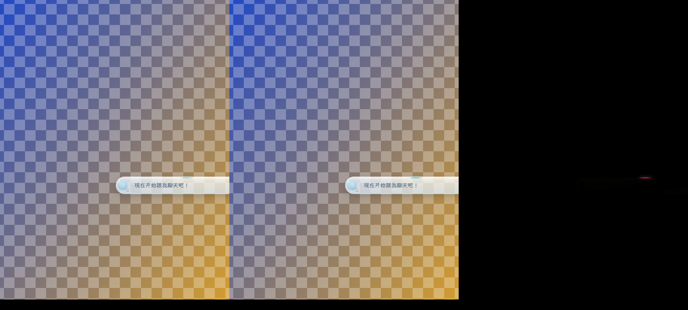
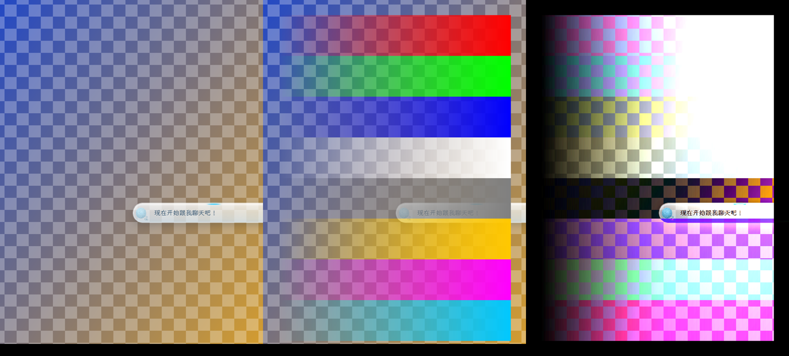
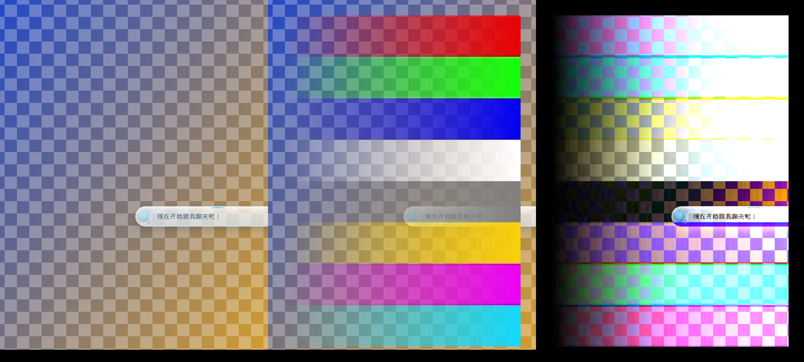
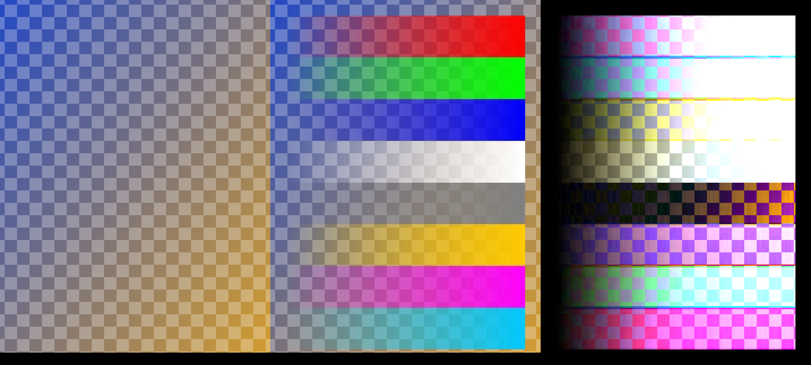
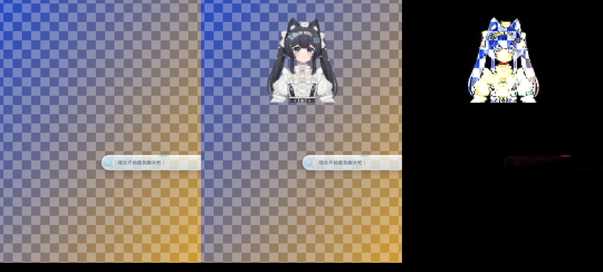
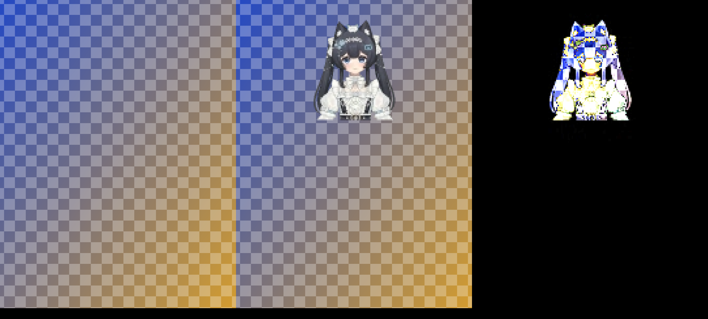

# 猫娘串门：T1~T5 实测记录

> 依据：[串门基础设施设计稿](./visit-infrastructure) §3.12「实测清单」、§3.3（同源 iframe 承载与能力门）、§3.4.2（打包）、§3.4.5（B 侧图层）、OD-27。
> 判定规则（§3.12）：T1~T4 任一失败，或 T5 的 2D `destination-in` 与 WebGL 打包 shader 都不成立 → 退设计 1。
> 实测日期 2026-10-02，兼容模式补测 2026-10-03。脚本在 `scripts/visit_probe/`，原始数据在 `scripts/visit_probe/results/{direct,compat}/results.json`，补测数据在 `scripts/visit_probe/results/compat-2026-10-03/results.json`，T2 黑帧诊断重测在 `scripts/visit_probe/results/compat-2026-10-03-blankcheck/`。

## 结论

**Windows 上 T1~T5 通过 → 继续 iframe 方案（OD-27），不退设计 1。**

**T2 兼容模式那一轮 17/312 黑帧的处理（owner 2026-10-03 拍板）**：该轮不计入 T2 判定。owner 判断很可能是测试期间人在操作电脑或后台有其他程序干扰（T2 不占鼠标，那一轮运行时并未要求停手）。旁证：同一轮的 timer30 / rAF 都是 0 黑帧；加诊断后在同一台机器、同一兼容模式下重测 25 轮约 7700 帧（timer60 15 轮）0 黑帧。原始数据与诊断方法保留在记录里，PR-10 实现期若再出现，按「待补测」里的判别表处理。

> 供判断的事实：设计 1（preload 异 host 直通补丁）与 iframe 方案的取帧都是「父页 postrender 同任务 drawImage」再打包，区别只在 iframe 是跨 realm 读取、打包画布在 iframe 里。若黑帧来自应用那一帧本身没画模型，或来自 drawImage 快照 / 打包步骤本身，换设计 1 也会同样出现；只有「同 realm 读得到、跨 realm 读不到」才是 iframe 特有的问题。

**还没关的闸门（PR-10/11 合并前必须补）：**
- §3.12 要求 T3/T4 同时在 macOS 上测，本次没有 Mac 设备，**T3/T4 的 macOS 部分待测**。

（兼容模式下访客不透明像素的命中已于 2026-10-03 补测通过，见 T3 行。）

另外测出 4 处需要回写设计稿的事实（见文末「对设计稿的修正」）。其中两处会影响 PR-10/11 的写法：
- §3.4.5 的「第二道保险」（`transparent-overlay` 类）实测单独不起作用。
- 兼容模式下每帧取帧打包要占主线程约 8 ms；累加器冷启动第一秒还会多抓帧，把这笔开销放大。

## 环境

| 项 | 值 |
| --- | --- |
| 壳 | 本地 `lanlan_release/lanlan_frd` @ `3c15525`（比 origin/main 落后 3 个提交，差异只涉及设置页 / 触屏区域 / 点击引导，与 T1~T5 无关），`npx electron-forge start` 开发态，多窗口，Pet 窗是全显示器透明窗 |
| 运行时 | Electron 41.2.0 / Chrome 146.0.7680.179，PIXI 7.4.3 |
| 系统 / 显卡 | Windows 11 Pro 26200，RTX 5090（ANGLE D3D11），1920×1080@60 Hz，DPR 1 |
| 后端 | 主仓库 `main@bed9e1850`，`uv run python launcher.py`，壳以「复用外部后端」模式接入 |
| 两种合成模式 | **兼容模式**（用户真实配置 `compatibilityMode:true` → `--disable-gpu-compositing --disable-direct-composition`，`gpu_compositing: disabled_software`，`webgl: enabled_readback`）；**直通模式**（临时 `NEKO_USER_DATA_DIR` 只把该项改成 false，`gpu_compositing: enabled`）。两种模式各跑一遍全部项目 |
| 测试页 | 同源静态页 `/static/_visit_probe/transport.html`（测完已删除），由 CDP（`--remote-debugging-port`）向 Pet 窗注入父页探针，不改任何产品代码 |
| 未覆盖 | macOS（无设备）；真实 75 / 144 Hz 显示器（用定时器驱动模拟同频率的 postrender 源）；多 DPR |

## 结果表

| 项 | 测法 | 观测值 | 通过 | 证据 |
| --- | --- | --- | --- | --- |
| **T1** 原生 WebSocket / RTCPeerConnection | Pet 窗父页建同源隐藏 iframe（1×1 置于视口外，§3.4.5 guest 样式），检查 `contentWindow.WebSocket` 的 `name`、`Function.prototype.toString` 是否 `[native code]`、原型链；iframe 内连本机 echo WS；同时在 Chat 窗包一层 `WSProxy._handleConnecting` 计数（即 `pet-websocket-bridge.js` 的 CONNECTING 扇出）；正对照：父页同样 `new WebSocket` | 两种模式一致：iframe `WebSocket.name='WebSocket'`、native、原型直连 `EventTarget`；父页是 `PetWebSocket`；`RTCPeerConnection` / `captureStream` / `requestVideoFrameCallback` 均 native；`isSecureContext=true`；iframe 自身 window 上没有 `electronScreen / __NEKO_MULTI_WINDOW__ / nekoFramePacing / require / process`。iframe 连 echo 2~4 ms 成功；**Chat 窗 CONNECTING 计数 0，Chat socket 保持 OPEN**。正对照：父页连接走 `PetWebSocket`，Chat CONNECTING +1，**Chat 的主 socket 被置为 CLOSED**（劫持 `_activeWs`，需重载 Pet 才恢复） | ✅ | `results.json → t1` |
| **T2** 同任务取帧 | 父页 `renderer.on('postrender')` 带两道守卫（RenderTexture / `lastObjectRendered===stage`）+ 分数累加器，**同步**调 iframe `sink.onFrame(#live2d-canvas, 裁剪)` → 2D 打包 → `requestFrame()`；①黑帧：逐帧回读打包下半（alpha 半）判全零，各 300 帧；对照：同样逻辑但 `setTimeout(0)` 推迟一个任务（等价 postMessage）；②30 fps 验收：打包画布 `captureStream(0)` → 本机环回 `RTCPeerConnection`（VP8 / H.264，560 kbps，`maintain-framerate`）→ `getStats()` 每档 10 s | **黑帧**：同步路径 timer30 / rAF-VSync / timer60 三种驱动下 0/302、0/310、0/310（直通），0/303、0/311、0/312（兼容）；**异步对照 223/311（直通）、264/311（兼容）是黑帧**。**帧率**（直通，源 postrender/s → 抓帧/s → 编码帧/s）：rAF 60.06→29.78→29.68；rAF 限 60 58.6→29.65→29.25；timer30 30.27→29.27→29.27；timer45 45.51→29.64→29.54；timer60 58.83→29.97→29.87；模拟 75 Hz 76.92→29.87→29.97；模拟 144 Hz 142.85→29.99→29.99；源 <30（24 Hz）23.87→23.87→23.77；H.264@timer60 编码 29.89；WebGL 打包 shader@timer60 编码 29.89。`outbound-rtp.framesPerSecond` 29~30，接收端解码 29.3~29.9。兼容模式数字同量级（29.35~29.93，<30 源 23.78）。**每帧打包耗时：直通 0.11~0.13 ms（峰值 ≤0.6 ms）；兼容 7.8~8.1 ms（峰值 ~11 ms）**（`results.json` 里的 `packMsAvg/packMsMax` 是同一 iframe 内从建立起的累计值，各档依次累加；各档读数本身几乎一致，WebGL 打包档用的是新 iframe、可视为独立样本）。2026-10-03 兼容模式补测按测量窗口单独计算：各档 6.8~7.3 ms。**⚠️ 2026-10-03 兼容模式补测的黑帧检测**：timer30 0/301、rAF 0/313，但 **timer60 一轮 17/312 黑帧**（`minAlphaSum` 0；异步对照 166/311）。该轮没有逐帧诊断，原因不明。随后给脚本加了诊断：出现黑帧时在同一任务里直接用 `gl.readPixels` 读 PIXI 的 WebGL 绘制缓冲同一区域、并在父页同 realm 用 2D 画布对同一区域 `drawImage` 作对照（后者 10-03 重测之后才加），记录模型是否仍挂在 `app.stage`、`visible / renderable / worldAlpha`、画布可见性。用诊断版重测 25 轮约 7700 帧（timer60 15 轮，含 Pet 页重载后 60 s 的一组），**0 黑帧，未复现** | ✅（兼容模式一轮 17/312 黑帧经 owner 判定为操作干扰、不计入；重测 0/7700） | `results.json → t2.blank / t2.fps` |
| **T3** iframe 透明与命中 | 受控背板窗口（固定渐变 + 棋盘，压在普通窗口之上、Pet 之下）上，§3.4.5 host 样式 iframe 摆在模型旁空位；**透明**：截「无 iframe / 有 iframe / 无 iframe」三张只含该区域的图逐像素比；**命中**：`SendInput` 注入真实鼠标移动（`SetCursorPos` 不经低级鼠标钩子，Electron `forward:true` 收不到），每个变体先移到模型脸部、再移到 iframe 中心，各 3 次，判据为 `WindowFromPoint` 是否命中 Pet 窗；变体含 z-index 9（设计原样）/ 11（压在画布之上）× `pointer-events` × `transparent-overlay` 类 | **透明**：兼容模式空文档、带闲置 WebGL 画布的 transport 文档与无 iframe **逐像素完全相同**（0/531,608 像素差 >8）；直通模式均值差 0.024，唯一的 >8 像素是 Pet 页面自己一个呼吸动画条（bg↔bg2 之间同样在变），iframe 贡献 0。没有白底 / 黑底。**命中**：正对照（模型脸部）两种模式 21/21 次命中 Pet。直通模式 iframe 中心：无 iframe 3/3 穿透；**z9 设计原样 3/3 穿透**；z9 不加任何保险 3/3；z11 `pe:none`+类 3/3；z11 只 `pe:none` 3/3；**z11 只有类（`pe:auto`）0/3**——整窗变可点；z11 都不加（负对照）0/3。兼容模式所有变体 3/3 穿透。**2026-10-03 补测不透明像素**：z9 设计写法的 iframe 显示图案、测试点落在图案 ~97% 不透明的灰色带上，屏幕取色 (129,129,128)（无 iframe 时同点为背板色 (193,169,130)，即图案确已画在该像素上），点击仍 3/3 穿透；模型脸部正对照 27/27 命中 Pet。所以兼容模式下访客的不透明像素**不会**吃掉点击，命中由本家模型决定、与叠层像素无关（此前「兼容模式按合成像素 alpha 穿透、不透明访客像素会吃点击」的推断不成立，已删除）。`elementFromPoint`：z9 任何样式与 z11 `pe:none` 都返回 `CANVAS#live2d-canvas`，z11 `pe:auto` 才返回 IFRAME | ✅ Windows 两种合成模式（含兼容模式不透明像素）；macOS 待测 | 下方证据图、`results.json → t3` |
| **T4** iframe 内透明 WebGL 画布合成 | 同一背板上，iframe 内透明 WebGL 画布（`alpha:true, premultipliedAlpha:true`，§3.4.5 解包 shader：上半取 rgb、下半取 r 作 a、`rgb=min(rgb,a)`）显示已知图案（8 色带 × alpha 0→255 横向渐变）；按「预乘色 + 背景×(1−a)」逐像素算期望值与截图比；另走完整链路 打包 → `captureStream` → 环回 RTC → 隐藏 2 px `<video>` → rVFC → 解包，并用真实模型跑一次 | **直通**：均值误差 0.45、p99 0.50（取整级），max 127 只出现在 0.11% 的色带分界像素（最近邻采样落在边界）；alpha=0 列与背景平均差 1.56。**兼容（DWM `disable-gpu-compositing`）**：0.45 / 0.50，同上。2D 源与 WebGL 源图案结果一致。经编解码链路：直通 8.6 / p99 76，兼容 3.4 / p99 62——起播 2.5 s 内 BWE 爬坡，编码分辨率只有 160×448（`qualityLimitationReason=bandwidth`），这属于 T6/T8/T12 的画质范畴，不是合成问题；真实模型经完整链路叠在背板上，alpha 边缘正确透出棋盘 | ✅ Windows 两种合成模式；macOS 待测 | 下方证据图、`results.json → t4` |
| **T5** 打包输出（alpha → 亮度） | 父页 postrender 同任务内，对同一裁剪同时做：参考（普通 2D 画布 `getImageData`，非预乘 RGBA）、2D `destination-in` 打包、WebGL 打包 shader（`UNPACK_PREMULTIPLY_ALPHA` 上传、上半 rgb / 下半 aaa）；逐像素比「下半亮度 == a」「上半 == 预乘色」；源：合成 2D 图案（覆盖全部 256 级 alpha）、`premultipliedAlpha:true` 的 WebGL 画布图案、真实 `#live2d-canvas`（上半身 320×448 5 帧 + 256×560 输出尺寸 1 帧；后者裁剪框仍按上半身比例推导，验证的是 256×560 几何下的打包，不是真正的全身构图） | 两种模式、所有源、两种打包：**alpha 最大误差 0**；上半预乘色最大误差 0.49~0.50（取整）；alpha=0 处上半全黑（泄漏 0）。白色带抽查：x=0/1/2/64/128/191/254/319 → 下半亮度 0/1/2/51/102/153/203/255，与期望逐一相等 | ✅（2D 与 WebGL 均成立） | `results.json → t5` |

## 证据图

每张图从左到右：无 iframe（背景）、有 iframe、差值放大 4 倍。截图只截测试区域，背景是受控的背板窗口。

**T3** 空 iframe，直通模式（右栏只有 Pet 页面自己的动画条在变）：

**T4** 图案经解包画布直接叠层，直通 / 兼容：

**T4** 图案经 VP8 环回链路，直通 / 兼容：

**T4** 真实模型经完整链路（打包 → captureStream → 环回 RTC → 隐藏 video → rVFC → 解包），直通 / 兼容：

## 对设计稿的修正（建议回写 §3.3.5 / §3.4.5 / §3.12）

1. **§3.4.5「两道保险」需要改写。** `#live2d-container` 是 `position:fixed; z-index:10` 的全屏层，设计里 iframe 的 `z-index:9` 实际在本家画布**之下**。视觉没问题（画布透明），命中也因此永远落在 canvas 上。
   - Pet 页 `body` 自带 `pointer-events:none`，iframe 默认就继承 none。
   - 实测「只靠 `transparent-overlay` 类」（`pointer-events:auto` 且 z 在画布之上）在直通模式下会让整窗变可点。原因是鼠标事件进了 iframe 文档，父页 preload 收不到 mousemove，穿透状态停在上一次的「不穿透」。所以这条保险单独不成立。
   - 建议正文改为：`pointer-events:none` 显式写死，且 z-index 保持低于 `#live2d-container`；`parent-bridge.js` 静态门同时校验这两条。删除「样式被覆盖时 `transparent-overlay` 类仍当背景」的说法。
2. **§3.3.5 第 5 条的成本估算只对直通模式成立。** 直通模式每帧打包 0.11~0.13 ms；兼容模式（`--disable-gpu-compositing`，WebGL 走 readback）7.8~8.1 ms。换成 WebGL 打包 shader 也是 ~8.1 ms，瓶颈是每帧从 WebGL 源取快照，不是 drawImage 次数。30 fps 下这约占 Pet 主线程 24%。帧率仍能保住（T2 兼容模式 29.4~29.9），但兼容模式用户（本机就是）会多付这部分开销。是否在兼容模式降帧 / 降档，交 PR-10 决定。
3. **分数累加器的 `renderFps` 估计有两个偏差，同一个改法都能修。**
   - **冷启动多抓**：刚挂钩子时 1 s 窗口里只有几帧，`renderFps` 等于已见帧数，`30/renderFps ≥ 1`，于是开头每帧都抓。模拟（按 §3.3.5 原式）第一秒抓帧数：45 Hz 源 42、60 Hz 源 50、75 Hz 源 57、120 Hz 源 71、144 Hz 源 76（目标 30）。**2026-10-03 兼容模式实测**（挂钩子起不预热，第一秒 / 第二秒抓帧数）：30 Hz 源 30 / 30；rAF 60 Hz 源 50 / 30；定时器 75 Hz 源 58 / 29；定时器 144 Hz 档（实际源约 118 Hz）66 / 32。与模拟吻合。兼容模式每帧 ~7~8 ms，第一秒的主线程开销被放大到约 0.35~0.5 s。
   - **源 ≈30 Hz 时少 ~2.4%**：timer30 实际 30.27 Hz → 抓帧 29.27。1 s 窗口计数常得 31，于是 `acc += 30/31`。
   - **改法**：`renderFps` 按窗口内首末帧的时间跨度算小数频率（`(n−1)/(t_last−t_first)`），样本不足 2 帧时用 `nekoFramePacing` 测得的刷新率作初值。模拟下 30.3~144 Hz 各源从第一秒起都恰好 30。
4. **帧率模式会被频繁翻转，但不影响结论。** preload 按 5~20 Hz 合成 pointermove，触发 `boostLinuxX11InteractiveFPS`，Pet 在 rAF 60 与定时器 30 之间反复切换。实测这种翻转下抓帧仍在 28.9~30.6。§3.4.4 的 `_visitCaptureActive` 方案可行；本次为了得到稳定的分档数字，测量期间临时停了 governor 和该升帧入口。

## 其他顺带观测（不在 T1~T5 判定内）

- 接收端 2 px / `opacity:0.01` 的 `<video>` 上 rVFC 为 23~29 次/s（解码 29.3~29.9），T7 时复核掉帧原因。原始数据里 H.264 档的 52~54 次/s 是脚本假象：该档在同一个 iframe 里重建了环回，旧 video 的回调重新挂到了新 video 上，循环变成两份（已修正，`transport.js` 把 rVFC 循环绑定到各自的 video；2026-10-03 补测 H.264 档为 27.7 次/s，确认是假象）。
- `encoderImplementation` 在 Electron 41 下取不到（undefined）。T6 要记编码器实现的话，得改用 `chrome://webrtc-internals`。
- **`getModelScreenBounds()` 不按视口裁剪。** 本机模型有一半挂在屏幕外（bounds 右下超出 1920×1080），按设计稿 3.4.1 比例算出的上半身框有 773 px 落在画布下方，所以 T4「真实模型」那张图里访客只占顶部一小条。这不影响本页结论：T4 的数值来自图案合成，T5 的参考与打包用同一裁剪框。但 PR-10 取景必须先与视口 / 画布求交、只用屏幕内可见部分再按比例构框（实测脚本已这样改）。
- 环回起播头几秒 `qualityLimitationReason=bandwidth`，分辨率被压到 160×448 / 240×672，之后回到 320×896。这和 §3.4.5 预计的「QP 缩放器降分辨率」是一类现象，留给 T6/T8 测稳态。

## 待补测

| 项 | 内容 | 期限 |
| --- | --- | --- |
| T3 / T4 macOS | 同一套脚本的 macOS 版本（截图、注入鼠标、窗口查找需要换成 macOS API） | PR-10/11 合并前 |
| 累加器冷启动 | 按上面第 3 条改法实现后，用 `drive.mjs t2` 的冷启动统计复验第一秒抓帧数 ≈30 | PR-10 内 |
| T2 黑帧（若再出现） | owner 已判定 10-03 那一轮不计入；PR-10 实现期如再出现，看 `blankDiag`：① `glReadAlphaSum` 为 0（且模型不在 stage / 不可见）→ 应用那一帧本来就没画模型，与 iframe 无关；② `glReadAlphaSum` > 0、`sameRealmDrawImageAlphaSum` 为 0 → drawImage 快照本身读空，两种方案都会有；③ 两者都 > 0 而打包为空 → 取帧或打包路径异常：跨 realm 读取或 iframe 内打包步骤，前者是 iframe 特有、要回到 §3.3.5 重新评估，后者设计 1 同样存在。用 `drive.mjs blank` 反复跑（不动鼠标，跑的时候别操作电脑） | 出现时 |

（兼容模式不透明像素命中、冷启动现状测量已于 2026-10-03 补测完成。）

## 原始截图

`results.json` 里 T3/T4 的 `bg / fg / bg2` 截图路径指向实测机上的运行目录，原始区域截图（两种模式合计约 7 MB）**没有入库**。入库的是由「背景 / 叠层 / 差值」拼成的三联图（`docs/design/visit-t1-t5/`），每张截图只含受控背板与 Pet 自身内容。要复核 `bgStable_*` 等比较数字，用 `scripts/visit_probe/` 重跑即可。

## 复现

见 `scripts/visit_probe/README.md`。
