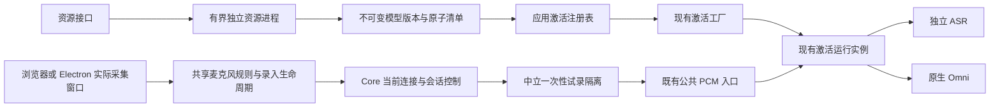

# 声纹实施：核心改动与审查边界

本次按采集修复、诊断预检、完整资源交付和激活恢复四个交付包实施。N.E.K.O 与 N.E.K.O.-PC 都从最新 main 建立独立 worktree；原工作区的已有改动保留。操作说明见 [声纹录入与语音激活修复](voice-readiness.md)。

## 核心改动、必要性与前后表现

| 改动 | 原行为及问题 | 实施后的行为 | 重点回归面 |
|---|---|---|---|
| `core/voice_readiness.py` 与中立的 `voice_input/preview.py` | 录入页无法证明关联主采集已停止，试录可能混入会话输入 | 实际采集窗口停止输入，后端退休并排空对应路径后发出一次性试录票据；公共 PCM 入口同时阻断其他生产者 | 停止、取消、超时、其他会话接管、JSON/二进制音频及排队输出 |
| `core/asr_runtime.py` 的小型组装与入口修改 | 缺少主输入和试录之间的统一隔离检查 | 复用原 ASR 和激活路由，仅增加隔离检查及目标会话控制入口 | 独立 ASR、原生 Omni、热切换、重放、队列与原生输出身份 |
| `voice_identity_service/resource_manager.py` 与服务公共入口 | 资源、采集质量和声纹匹配故障容易混为同一错误 | 资源准备和试录在正式录入前完成；有界独立进程执行模型准备及同一 DSP 链的质量检查 | 原生组件挂起、进程崩溃、取消、DSP 变化、45 秒录入时限和档案保护 |
| 激活工厂、应用注册表和唤醒资源发现 | 已安装缓存不能按启用偏好装配，资源错误可能被泛化 | 显式配置优先，启用后发现完整已校验缓存；已启用但资源异常保持阻断；资源修复更新工厂权威 | 权限与档案版本、准备失败、旧实例迟到及修复后重新准备 |
| 当前会话重试 | 不可用状态缺少目标明确的恢复入口 | 退休旧实例后重建；传输结果不确定的路径要求用户显式重启语音会话 | 不重投旧音频、不重用已退休 provider、输出失败和超时 |
| 资源修复后的声纹权威 | 资源加载成功不能证明已有档案和音频契约可用 | 刷新复核档案、模型身份、DSP 契约、运行模式与未完成的 DSP 切换；不满足时保持对应不可用原因 | 无档案、旧模型档案、降噪不匹配、运行关闭、切换未完成及启用偏好不变 |

声纹阈值、检查时机、48 kHz 单声道输入、16 kHz 后端链、三段参考加一段验证、45 秒总时限和档案格式均保持现有约定。新增正式录入请求字段是兼容扩展，用于核对已试录的 DSP 配置。

## 依赖与权威

模型包与偏好共用位于配置基础层的标准库文件锁；`main_logic` 不依赖应用入口，配置层不反向引用工具层。部署资源的发现、安装与发布属于应用服务外层，中立的 `voice_input` 仅保留运行契约与检测接口。全仓模块分层和 Core 包契约检查作为守门保留；`voice_readiness` 明确登记为 ASR bridge 的 owner 子模块。前端持续状态仅消费既有 `VOICE_SESSION_ACTIVATION_STATE`，恢复请求走既有 WebSocket 控制通道。IPC 只交换身份和操作结果，不传 PCM 或跨 partition 的设备编号。

## 新增资源的消费者

| 资源 | 发布、读取与清理边界 |
|---|---|
| 临时下载目录与标记 | 固定包安装器独占管理；固定来源、摘要、大小与解包白名单；中断后仅清理本功能明确拥有的临时目录 |
| `versions/<version>` | 完整校验和真实试加载后发布；运行实例继续使用原路径；不覆盖旧目录，最多三个版本并限制总占用 |
| `current.json`、`current.pending` | 原子替换的完整版本指针；缓存发现和后端激活读取同一规则；提交前取消或发布失败保留原指针；提交开始后的取消等待真实结果，`committed` 区分已发布与未发布；中断遗留的固定 pending 文件只在本功能的 OS 锁下处理 |
| `preference.pending`、偏好与锁 | 有界、串行、原子写入；下载不改启用偏好；不关联声纹档案保存 |
| 唤醒运行组件 | 固定源码与补丁构建，Windows x64 打包；冻结程序须通过真实模型加载检查后才可交付 |
| 修复指南、前端资源和测试 | 同源固定只读指南随冻结包交付；新增脚本由模板资产版本管理；八语缓存版本更新；Node 和 Electron 测试进入 CI |

缓存达到上限时停止安装并提示受控维护，避免删除仍在使用的旧版本。回退可以使用原显式模型路径，不改档案或启用偏好。

## 验证与实际限制

回归通过实际 WebSocket 入口和受控下游接收端验证独立 ASR／原生 Omni、JSON／二进制音频、等待／异常／试录期间的实际音频递交。Electron 验证使用实际模板、AudioWorklet、窗口、Session、桥接和更新面板；输入来自 Chromium 受控测试设备。

本机已用受控语音通过真实 CAM++、Silero 和 RNNoise 完成试录、三段参考加一段验证、成功保存及失败重录后的原档案保护。真实浏览器已验证资源准备和设备列表。该结果不替代实际物理麦克风、断插设备和不同声学环境的验收。

定稿后的联合 Python 回归为 1,939 项通过、4 项跳过；前端 Node 为 151 项通过，桌面采集控制为 18 项通过。三条实际 Electron 流程覆盖录入页面与 AudioWorklet、实际采集窗口和 Session 隔离、关于面板更新修复入口。八语提示、Node／Electron CI 入口、Ruff、异步阻塞和全仓模块分层检查均已核对。

新增模块按行覆盖率验收：Core 控制 90%、中立隔离 99%、唤醒资源发现 97%、错误白名单 100%、资源管理 85%、模型包交付 84%；前端共享采集 93.02%、试录与资源页面 84.46%、主会话状态与控制 83.86%。前端分支与函数覆盖低于行覆盖，Electron 验收未合并到这些百分比中。

桌面仓库全量测试仍有基线失败：6 项 unit、11 项 contract 失败在未修改的 `a4fe791` 基线也可复现。本次新增的采集、桥接和修复流程测试通过；不能将这些结果表述为桌面仓库全量测试全绿。

Windows 冻结安装包和定制唤醒组件的源码构建、安装、模型真实试加载及冻结程序检查已接入打包流水线。本机缺少该原生构建工具链，尚未生成或验收更新后的安装包，不能将源码测试结果视为冻结包已经可发布。

核心模块 review 应优先检查试录隔离的生产者权威、每个 await 后的身份校验、旧任务退休、资源原子发布，以及 ASR／Omni 两条真实递交路径。此合同跨两仓库，配套版本需要一起验收；分别回退时仍须保留门控和用户档案。

## 首轮审查核验

审查对象为 `533d2d5de`，只有事实成立且属于实施合同的问题进入修复。

本轮生产代码的联合回归为 2,225 项通过、4 项跳过，前端 Node 为 157 项通过，真实 Electron 页面通过。随后启动预算测试的 9 项回归通过：配置响应超过旧测试的三秒探针仍可在生产启动预算内创建新会话；强制等待旧 worker 物理退出的反证仍失败。该调整仅修正测试的因果判断，没有改生产 TTS、启动预算、容量或退休逻辑。

| 意见 | 核验与处理 |
|---|---|
| [试录代次必然失效](https://github.com/Project-N-E-K-O/N.E.K.O/pull/3282#discussion_r4171613153) | 误报；闭包读取更新后的操作代次，真实控制入口的成功试录已证明此路径可用 |
| [成功试录被重复释放](https://github.com/Project-N-E-K-O/N.E.K.O/pull/3282#discussion_r4171613155) | 成立；真实 Core、API 与两端前端协议复现，修复为绑定原 owner、限时限量的消费销账记录，旧销账不解除新试录 |
| [取消后发布模型](https://github.com/Project-N-E-K-O/N.E.K.O/pull/3282#discussion_r4171613157) | 成立；分离不可变版本准备与指针提交，取消返回实际发布结果并重新准备运行权威 |
| [取消检查仍显示就绪](https://github.com/Project-N-E-K-O/N.E.K.O/pull/3282#discussion_r4171613159) | 成立；就绪仅在刷新及操作、DSP 身份复核通过后发布 |
| [默认 home 解析异常](https://github.com/Project-N-E-K-O/N.E.K.O/pull/3282#discussion_r4171625614) | 成立；配置读取、资源解析与快照返回稳定的不可用原因，保持失败阻断 |
| [PowerShell 5.1 命令引号](https://github.com/Project-N-E-K-O/N.E.K.O/pull/3282#discussion_r4171625617) | 成立；检查命令改为读取既有版本常量，避免原生参数传递中的嵌套引号 |
| [Core owner 未注册](https://github.com/Project-N-E-K-O/N.E.K.O/pull/3282#discussion_r4171625619) | 成立；登记 ASR bridge 的控制 owner 子模块，保留 Core 结构检查 |
| [偏好进程五秒预算](https://github.com/Project-N-E-K-O/N.E.K.O/pull/3282#discussion_r4171625623) | 本机三次真实冷启动约 0.5 秒，未复现；保留可物理退休的有界独立进程，冻结包冷启动仍待验收 |
| [资源刷新绕过档案检查](https://github.com/Project-N-E-K-O/N.E.K.O/pull/3282#discussion_r4171625627) | 成立；补齐模型身份、档案和 DSP 契约、运行模式与未完成切换检查，保持档案和偏好不变 |
| [中立层依赖配置](https://github.com/Project-N-E-K-O/N.E.K.O/pull/3282#discussion_r4171625633) | 分层事实成立；资源实现迁到应用服务外层；拒绝配置反向导入领域实现的建议，保留双重分层守门 |
| [重试超时结果不确定](https://github.com/Project-N-E-K-O/N.E.K.O/pull/3282#discussion_r4171625637) | 成立；要求用户显式重启，阻断输入及迟到状态，旧重试不能修改新会话的控件或门控 |
| [管理窗口缺共享麦克风模块](https://github.com/Project-N-E-K-O/N.E.K.O/pull/3282#discussion_r4171625644) | 成立；桌面转发使用其自身操作编号来源，接住同步 IPC 异常并恢复菜单，仍由实际采集窗口打开录入 |

## 提交后刷新超时核验

| 意见 | 核验与处理 |
|---|---|
| [已提交资源的刷新超时原因](https://github.com/Project-N-E-K-O/N.E.K.O/pull/3282#discussion_r4171724770) | 成立；已发布模型包后的运行时刷新超时误报为资源准备超时。修复在刷新边界使用既有 `runtime_degraded` 权威原因，保留 `committed=true` 与已安装结果；实际提交、五秒刷新超时及并发取消证明旧版本保留、新指针不回滚，提交前工作进程超时反证仍报告 `resource_prepare_timeout` |

该条定向资源与真实 API 回归共 65 项通过，Ruff、异步阻塞、Core 契约及全仓分层守门通过。删除新增超时分类的突变版本会在真实已提交刷新超时测试中失败，实际得到旧错误码 `resource_prepare_timeout`，证明测试能够识别这次修复的行为差异。

前端资源控制器的 29 项回归通过，下载轮询与取消两条路径复用既有八语激活异常提示。实际控制器读取 `committed=true`、`installed=true` 的失败结果后，显示运行时不可用原因，刷新仍保留就绪模型并读取会话状态，不改启用偏好，也不误报取消。

## 联合协议测试的失败出口

[协议测试的异步拒绝](https://github.com/Project-N-E-K-O/N.E.K.O/pull/3282#discussion_r4171733566)成立，仅修复测试工具。RPC 拒绝与控制回调异常统一交给主测试失败出口；六秒 RPC 确认期限介于 Core 五秒清理预算与客户端八秒控制等待之间。错误 JSON、未知回执和管道关闭走同一失败出口，结束时释放读入监听与定时器。产品协议、会话预算及音频门控未修改。

六种真实子进程故障与四种真实 Core／API／两端 JS 联合场景共 10 项通过，控制与隔离联合回归 94 项通过。临时恢复旧 RPC 异常链后，拒绝与回调异常两项反证均失败；修复后的子进程自然退出为 1，携带主测试诊断，没有未处理的 Promise 拒绝。

本次追加修复的录入与资源前端回归共 106 项通过，实际 Electron 41.2.0 页面和 AudioWorklet 验证通过。前序提交 `2a52cdd` 的全量 Windows pytest 为 27,120 项通过、153 项跳过，全部 checks 已通过；这项结果对应前序提交，不替代追加提交的 CI。

## 偏好保存进程的冷启动依赖

[偏好进程五秒预算](https://github.com/Project-N-E-K-O/N.E.K.O/pull/3282#discussion_r4171625623)的重依赖问题已落实修复：偏好写入使用独立轻量 spawn 入口，反序列化目标时不再导入资源管理、录入、ASR 或 numpy。保持五秒预算、原子文件写入、OS 锁以及取消时物理退休工作进程，未改用无法物理终止的线程。

真实 spawn 回归在子进程禁止上述重依赖，仍能通过生产入口保存偏好；临时恢复旧资源工作进程入口则失败。回归也验证取消后子进程退出、管理配置与损坏偏好的错误保持，以及发布检查使用隔离缓存完成启用和禁用并恢复部署环境。

现有 Windows 冻结程序 wake smoke 增加两次生产偏好写入及耗时输出，构建流水线必须收到两条成功证据才可交付。此处补齐的是代码修复和实包验收门；本机源码测试不代表冻结安装包冷启动已经通过。

## 第二轮审查的四组修复

本轮以 `532e276` 为后端审查基线，按备忘录第 8 节核实正常支持场景，仅修复合同内的四组问题。桌面基线为已合入 #504、#505 的 `0be8c57`，保留其迟到释放、窗口生命周期和旧前端兼容处理。

| 成立问题 | 根因与修复 | 回归边界 |
|---|---|---|
| 资源查询与发布重叠时失败，历史准备结果被后续发布改写 | 文件发现线程不再读取事件循环的可变状态；返回后以 DSP 和准备代次复核，再合成独立快照。操作结果与准备缓存分别复制，发布前按新代次失效唤醒准备状态 | 文件发现与真实发布受控交错、旧成功结果及调用方修改返回对象，不允许旧版本被误认证为就绪 |
| 主采集仍运行时启用唤醒词只显示泛化错误 | 后端的 `preview_owner_active` 保持原拒绝行为；八语提示明确要求停止主麦克风，原复选框状态恢复 | 实际偏好入口及八语错误格式，不为偏好写入强行创建试录隔离，也不改失败时的启用偏好 |
| 服务端接受准备或下载后启动回执丢失，页面无法命名和取消任务 | 新前端先预留服务端操作编号，再发送启动。预留仅占有界记录、不创建 worker；取消失败时保留已知编号及重试出口，不接管全局快照中的其他操作 | 真实 ASGI 已接受启动但响应丢失、重复启动、关闭页面、取消回执丢失、过期和容量上限 |
| 主麦克风已物理停止但后端隔离失败，桌面仍把旧窗口视作正在采集 | 父窗口返回能跨 contextBridge 的普通数据，将 `physicalStopped` 与隔离成功的 `stopped` 分开。桌面只对匹配窗口、会话、代次和操作的 owner 更新采集事实，保留失败隔离 fence 及其有界恢复 | 真正 Chromium 音轨停止、原生 IPC、后端失败、期限到达后的新窗口接管及旧代次迟到；物理停止不能授权试录或绕过下游门控 |

资源新协议为 `POST /api/voice-identity/resources/operations` 接受严格的 `kind`，返回 `reserved` 与操作编号；随后 `POST /api/voice-identity/resources/operations/{id}/start` 才启动既有任务。预留使用单调时钟、30 秒期限，全部记录最多 16 条；只淘汰已退休记录。过期、取消、完成的编号不会创建新任务，已淘汰编号明确拒绝。旧空正文 prepare/download 接口保持兼容，所有新增写入口沿用原 loopback、Origin 和 CSRF 边界，不接受外部 URL、路径或安装命令。

新资源页面需要配套的新后端协议。Electron 失败后的采集归属修复需要 [桌面 #509](https://github.com/Project-N-E-K-O/N.E.K.O.-PC/pull/509)，提交 `542376a`；旧桥接继续接受缺少新字段的旧前端回执。IPC 只传操作结果，保持既有 Session 隔离，不传 PCM，也不自动恢复主麦克风。

本轮先完成声纹服务、API、音频入口及控制的联合 Python 回归：680 项通过、3 项跳过；随后补充真实丢失回执场景及最终出口后，定向资源、完整声纹 API 与缓存契约回归为 221 项通过，资源管理和路由行覆盖率分别为 88%、84%。最终录入与资源 Node 回归 111 项通过。Ruff、Core 契约、模块分层和异步阻塞检查通过。

桌面采集与相关 owner 回归 76 项通过，采集协调器行覆盖率 99.31%、桥接 100%；三条实际 Electron 流程通过，覆盖窗口归属、物理停止后隔离失败与修复入口。后端实际 Electron 录入页及 AudioWorklet 回归通过。另以当前两端代码执行真实音轨和原生 IPC 联合场景，旧协调器的突变版本在恢复后的新窗口接管时再次报 owner 歧义，修复版本可打开正确 Session。

以上 Electron 输入使用 Chromium 受控测试设备，不替代物理麦克风和冻结安装包验收。声纹参数、正式录入时限、档案、启用偏好、ASR／Omni 激活门控和不确定音频的失败阻断均保持原合同。旧提交的全量 CI 结果不能代替本轮新 head；桌面全量基线失败及上游 Actions 账户限制仍需单独处理。

## 第三轮逐条评论修复

| 评论 | 核验和修复 |
|---|---|
| [spawn 阻塞事件循环](https://github.com/Project-N-E-K-O/N.E.K.O/pull/3282#discussion_r4173418009) | 成立；启动放到线程，取消等待启动取得进程句柄后物理退休。288 KB 参数与受控慢启动证明主循环仍响应，取消无遗留进程 |
| [隔离期间启动会话](https://github.com/Project-N-E-K-O/N.E.K.O/pull/3282#discussion_r4173418291) | 隔离早退遗漏失败出口和文本撤权成立；现有 started 回执已携带 blocked 路由，追加明确 preview_busy 状态及撤权，文本仍走原失败出口。连接断开仅释放其原票据，不能释放新连接的票据；不自动重开已退休路由 |
| [双路释放竞态](https://github.com/Project-N-E-K-O/N.E.K.O/pull/3282#discussion_r4173418514) | 成立；未 claim 的取消及 HTTP token 释放也留下绑定原 owner、原期限、最多 32 条的清理回执，随后 preview_end 可幂等确认；旧清理不释放新试录 |
| [控制消息阻塞接收循环](https://github.com/Project-N-E-K-O/N.E.K.O/pull/3282#discussion_r4173418748) | 成立；两条 WebSocket 控制入口均派发连接拥有的后台任务，先安装 PCM fence，再接收下一帧；并发准备／重试立即拒绝，断开取消任务并释放票据。真实原生／独立 ASR 入口证明等待期间 PCM 被丢弃且停止仍被接收 |
| [下载前端预算过短](https://github.com/Project-N-E-K-O/N.E.K.O/pull/3282#discussion_r4173418941) | 成立；下载等待 210 秒，覆盖后端 180 秒下载、提交、刷新与退休；准备保持独立 60 秒预算。模拟 130 秒下载未被提前取消 |
| [清理提前删除 ownership marker](https://github.com/Project-N-E-K-O/N.E.K.O/pull/3282#discussion_r4173419201) | 成立；正常与遗留 stage 清理均在 payload 全部删除后才删除 marker，受控文件锁失败仍保留标记并可重试；无标记的非空目录继续拒绝删除 |
| [共享输入设置取消录入](https://github.com/Project-N-E-K-O/N.E.K.O/pull/3282#discussion_r4173419441) | 成立；storage 事件在录入期间只使试录证明失效，更新下一次输入设置，不停止当前采集或取消录入；真实设备失效仍走原检查 |
| [publish 冷启动重依赖](https://github.com/Project-N-E-K-O/N.E.K.O/pull/3282#discussion_r4173419660) | 成立；与 preference 对称使用轻量进程入口，禁止导入音频／资源管理依赖的真实 spawn 测试通过。冻结程序增加五秒内真实模型指针发布检查，使用隔离副本，不修改实际安装目录 |
| [资源发现异常漏捕获](https://github.com/Project-N-E-K-O/N.E.K.O/pull/3282#discussion_r4173419867) | 成立；路径和 pointer 探测纳入异常边界，manifest 必须为 dict，权限错误和 list manifest 均转换为稳定模型不可用原因 |
| [DSP 切换误报录入中](https://github.com/Project-N-E-K-O/N.E.K.O/pull/3282#discussion_r4173622033) | 成立；试录隔离与试录检查一致返回 audio_contract_changed，实际录入仍返回 enrollment_in_progress |

ASR 路由、全 voice_input、声纹服务／API、真实 WebSocket 与缓存契约联合回归 1,571 项通过、7 项跳过；最终冻结存储验收 helper 的真实双开关与发布分支另通过 1 项。Node 回归 160 项通过。Ruff、Core 契约、全仓分层与异步阻塞守门通过。冻结安装包的实际执行结果仍须由更新后的发布流水线验证。

## 后续关闭、目录和继续录入审查

[CodeRabbit](https://github.com/Project-N-E-K-O/N.E.K.O/pull/3282#discussion_r4173686420) 与 [独立审查](https://github.com/Project-N-E-K-O/N.E.K.O/pull/3282#discussion_r4173687763) 指向同一关闭问题，成立。预留记录淘汰排除当前操作，关闭直接退休当前对象，不依赖可淘汰的编号索引；试录退休置于 finally，防止当前操作异常跳过清理。回归覆盖已完成当前操作与 15 个未启动预留凑满容量，以及复现旧缺失索引后关闭仍退休试录。

[重定向祖先目录](https://github.com/Project-N-E-K-O/N.E.K.O/pull/3282#discussion_r4173688093) 的兼容问题成立。共享底层函数先拒绝缓存根本身的符号链接／Windows reparse point，再解析系统或用户目录的祖先重定向，模型与偏好保持相同边界；缓存下层目录仍分别校验。真实目录链接回归验证通过重定向祖先安装、解析及保存偏好，同时拒绝被替换为链接的缓存根，不修改原偏好。

[继续录入携带 null 契约](https://github.com/Project-N-E-K-O/N.E.K.O/pull/3282#discussion_r4173688555) 成立。恢复服务端既有录入时不要求新试录证明，也不发送 null 契约，沿用该录入已有合同；开始新录入仍需要有效试录，包括旧录入已被预检取消后的替代开始。按钮和请求同步修复，前端回归验证从服务端第三段继续和新录入不能绕过试录。

本轮最终联合回归含模型交付共 1,576 项通过、7 项跳过；Node 162 项通过。Ruff、Core、分层与异步检查通过。上述结果对应源代码回归，最新 head 的 CI 和冻结包验收须分别核验。

## 10 月 4 日（北京时间，UTC+8）审查和 CI 修复

本轮重新合并最新 main，保留双方八语内容并更新缓存版本。每分钟评论与最新 head CI 监听已创建。

- [继续录入输入失效](https://github.com/Project-N-E-K-O/N.E.K.O/pull/3282#discussion_r4173731228)、[共享设置混入不同输入](https://github.com/Project-N-E-K-O/N.E.K.O/pull/3282#discussion_r4174073568)：设置变化持久标记当前录入不可继续，按钮与开始、设备准备后的检查一致要求用户取消后重新试录；当前采集不被 storage 事件隐式取消。标记只能由新的成功试录清除，页面重载不会绕过。输入未变化的原录入仍可继续。
- [Node 启动超时](https://github.com/Project-N-E-K-O/N.E.K.O/pull/3282#discussion_r4174072907)：Windows CI 失败发生在启动请求尚未到达，测试启动和普通退出 watchdog 调整为 20 秒。丢失确认仍要求测试工具在自身六秒预算内失败，外部八秒验证不变。
- [冻结 smoke 路径比较](https://github.com/Project-N-E-K-O/N.E.K.O/pull/3282#discussion_r4174073221)：实际失败的 Unit pytest 与该意见一致，临时缓存根在入口规范化。普通与真实重定向临时目录均通过启用、禁用和发布验收 helper；不把源代码 helper 执行称为冻结包已通过。
- [隔离检查改变代次](https://github.com/Project-N-E-K-O/N.E.K.O/pull/3282#discussion_r4174073943)：音频隔离检查提前，报告独立于 ASR provider 的 `VOICE_INPUT_PREVIEW_BUSY`，不增代次、不关闭当前试录；文本仍走既有撤权出口。真实 Core 票据 current 回调验证启动重入不作废票据，八语提示明确完成或取消试录。
- [启动取消被失败覆盖](https://github.com/Project-N-E-K-O/N.E.K.O/pull/3282#discussion_r4174074259)、[关闭中的取消](https://github.com/Project-N-E-K-O/N.E.K.O/pull/3282#discussion_r4174074629)：共享退休 helper 等待物理操作后传播取消，并在同时失败时保留取消。Core 关闭保留自身五秒预算，调用方取消不能提前切断；WebSocket 先退休控制任务，记录其间的外部取消，完成连接清理后再传播。已提交资源的结果语义保持原合同。
- [无效的一键重启](https://github.com/Project-N-E-K-O/N.E.K.O/pull/3282#discussion_r4174432918)：隐藏不能重建后端路由的麦克风快捷重启，八语引导用户关闭后用主麦克风按钮走完整语音会话启动，不再调用只有 lease_sync 的 startMicCapture。
- [刷新取消后仍报告 READY](https://github.com/Project-N-E-K-O/N.E.K.O/pull/3282#discussion_r4174433322)：资源激活刷新采用既有 cancellation-safe 机制，先完成真实结果应用再传播取消。回归分别验证最终激活成功与失败，不发布与实际授权相反的状态。
- [旧身份拒绝 owner 释放](https://github.com/Project-N-E-K-O/N.E.K.O/pull/3282#discussion_r4174433615)：释放保留 token 与 owner 校验，移除只适用于 begin/claim 的 current 校验；降噪或身份变化后仍能释放自己的票据，释放不恢复输入权威。
- [损坏偏好无法修复](https://github.com/Project-N-E-K-O/N.E.K.O/pull/3282#discussion_r4174433912)：读取仍失败阻断且不隐式写入，用户明确保存开关时可原子修复损坏偏好；管理配置和符号链接仍拒绝，锁与写入错误仍返回失败。
- [无 owner 类型](https://github.com/Project-N-E-K-O/N.E.K.O/pull/3282#discussion_r4174434189)：生产者退休使用 Core 的标准字符串 `none`。
- [主资源错误误归唤醒词](https://github.com/Project-N-E-K-O/N.E.K.O/pull/3282#discussion_r4174434460)：audio/prepare 意外异常使用现有通用资源 worker 原因，wake 操作保留专用原因。
- [采集归属拒绝误报 Worklet](https://github.com/Project-N-E-K-O/N.E.K.O/pull/3282#discussion_r4174434729)：注册失败单独释放本次私有采集图并返回 false，不设置 Worklet 故障标志或弹出错误的 Worklet 提示。

相关 ASR、声纹、隔离、API、WebSocket、麦克风启动和缓存回归共 1,613 项通过、7 项跳过；重定向临时目录 smoke 另有 2 项通过；Node 164 项通过。Ruff、Core 契约、分层和异步阻塞检查通过。最新提交的 CI 与冻结程序结果继续由监听核验。

后续 CodeRabbit 补查确认：shielded close 在外层五秒预算到期后仍可能执行另一段五秒退休，begin 最坏为十秒。前端 owner 等待改为十三秒，浏览器 opener 确认十五秒，丢失确认的最大兜底同步为七十三／七十五秒；测试 RPC 使用十二秒内部确认预算、十四秒外部丢失确认 watchdog。既有录入获得回退设备时也持久设置输入变化标记，设备准备后的继续检查据此拒绝。日期依据本地 UTC+8，源码测试使用 uv 是用户明确项目规范；这两项没有改成计划工作或无 uv 执行。
